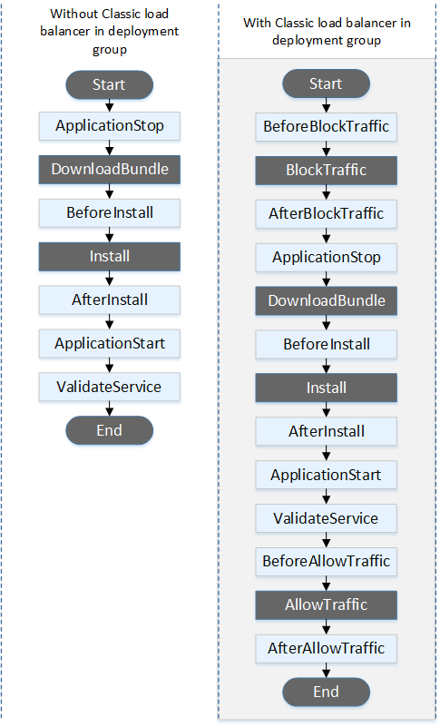

# aws-cert-dva-c01

<!-- vim-markdown-toc GFM -->

* [AWS IAM](#aws-iam)
	* [IAM Users](#iam-users)
	* [IAM Groups](#iam-groups)
	* [IAM Roles](#iam-roles)
	* [Temporary credentials](#temporary-credentials)
* [AWS Cloudformation](#aws-cloudformation)
	* [What is AWS CloudFormation?](#what-is-aws-cloudformation)
	* [Concepts](#concepts)
	* [How is AWS CloudFormation different from AWS Elastic Beanstalk?](#how-is-aws-cloudformation-different-from-aws-elastic-beanstalk)
	* [What are the elements of an AWS CloudFormation template?](#what-are-the-elements-of-an-aws-cloudformation-template)
	* [Stacksets](#stacksets)
* [Elastic Beanstalk](#elastic-beanstalk)
	* [Config files](#config-files)
	* [Custom scripts and programs](#custom-scripts-and-programs)
	* [Versions](#versions)
		* [Managing Application Versions](#managing-application-versions)
* [AWS ECS](#aws-ecs)
	* [I want to launch containers. Why do I have to launch Tasks?](#i-want-to-launch-containers-why-do-i-have-to-launch-tasks)
* [VPC](#vpc)
	* [What are the components of Amazon VPC?](#what-are-the-components-of-amazon-vpc)
	* [How do I get started with Amazon VPC?](#how-do-i-get-started-with-amazon-vpc)
	* [VPC and Subnets](#vpc-and-subnets)
	* [Endpoints](#endpoints)
* [AWS DNS](#aws-dns)
* [AWS Elastic IP](#aws-elastic-ip)
* [AWS RDS](#aws-rds)
	* [Connecting to an RDS instance](#connecting-to-an-rds-instance)
	* [Monitoring](#monitoring)
	* [MySQL Database Log Files](#mysql-database-log-files)
* [AWS CodeDeploy](#aws-codedeploy)
	* [Sequence of Hooks](#sequence-of-hooks)
		* [Lambda Function Version Deployment](#lambda-function-version-deployment)
		* [EC2 - In-place deployments](#ec2---in-place-deployments)
		* [EC2 - Blue/green deployments](#ec2---bluegreen-deployments)
	* [Deployment, Rollback, Redeployment](#deployment-rollback-redeployment)
* [AWS S3](#aws-s3)
	* [Best practices](#best-practices)
	* [Requiring HTTPS for Communication Between CloudFront and Your Amazon S3 Origin](#requiring-https-for-communication-between-cloudfront-and-your-amazon-s3-origin)
	* [Cross Region Replication](#cross-region-replication)
	* [MFA](#mfa)
	* [S3 Inventory](#s3-inventory)
	* [Object lifecycle management](#object-lifecycle-management)
		* [Transition actions](#transition-actions)
		* [Expiration actions](#expiration-actions)
		* [When Should I Use Lifecycle Configuration?](#when-should-i-use-lifecycle-configuration)
		* [How Do I Configure a Lifecycle?](#how-do-i-configure-a-lifecycle)
	* [Configuring Amazon S3 Event Notifications](#configuring-amazon-s3-event-notifications)
* [AWS Cognito](#aws-cognito)
	* [Streams](#streams)
* [Kinesis](#kinesis)
	* [Stream](#stream)
		* [Kinesis Data Streams High-Level Architecture](#kinesis-data-streams-high-level-architecture)
		* [Terminology](#terminology)
		* [Enhanced fan-out](#enhanced-fan-out)
	* [Data Firehose](#data-firehose)
	* [Server-Side Encryption with Kinesis Data Streams as the Data Source](#server-side-encryption-with-kinesis-data-streams-as-the-data-source)
* [AWS DynamoDB](#aws-dynamodb)
	* [Read Request Units and Write Request Units](#read-request-units-and-write-request-units)
	* [Streams](#streams-1)
	* [DynamoDB Streams and AWS Lambda Triggers](#dynamodb-streams-and-aws-lambda-triggers)
	* [Global Tables](#global-tables)
	* [DynamoDB Queries](#dynamodb-queries)
	* [DynamoDB Scans](#dynamodb-scans)
	* [DynamoDB Scan VS Query](#dynamodb-scan-vs-query)
	* [Monitoring](#monitoring-1)
* [AWS System Parameter Store](#aws-system-parameter-store)
* [API Gateway](#api-gateway)
	* [Auth](#auth)
	* [Stage](#stage)
* [AWS KMS](#aws-kms)
	* [generate-data-key-without-plaintext](#generate-data-key-without-plaintext)
* [AWS EFS](#aws-efs)
* [AWS Lambda](#aws-lambda)
	* [Deployment](#deployment)
	* [Traffic Shifting Using Aliases](#traffic-shifting-using-aliases)
	* [Handle Lambda Service Exceptions](#handle-lambda-service-exceptions)
	* [AWS SAM](#aws-sam)
		* [AWS SAM Template Concepts](#aws-sam-template-concepts)
* [AWS Step Functions](#aws-step-functions)
* [AWS Secrets Manager](#aws-secrets-manager)
* [AWS Data Pipeline](#aws-data-pipeline)
	* [What is a data node?](#what-is-a-data-node)
	* [What is a pipeline?](#what-is-a-pipeline)
	* [What is an activity?](#what-is-an-activity)
* [AWS X-ray](#aws-x-ray)
* [AWS Quicksight](#aws-quicksight)
* [AWS Batch](#aws-batch)
	* [AWS Batch Event Stream for CloudWatch Events](#aws-batch-event-stream-for-cloudwatch-events)
* [AWS SNS](#aws-sns)
	* [Amazon SNS Message Filtering](#amazon-sns-message-filtering)
* [AWS CodePipeline](#aws-codepipeline)
	* [What is AWS CodePipeline?](#what-is-aws-codepipeline)
	* [What is a pipeline?](#what-is-a-pipeline-1)
	* [How do I start a pipeline?](#how-do-i-start-a-pipeline)
	* [How can I provision and manage my AWS resources through a release workflow process?](#how-can-i-provision-and-manage-my-aws-resources-through-a-release-workflow-process)
	* [Integrations](#integrations)

<!-- vim-markdown-toc -->

## AWS IAM

https://docs.aws.amazon.com/IAM/latest/UserGuide/id.html


### IAM Users

The IAM user represents the person or service who uses the IAM user to interact with AWS. A primary use for IAM users is to give people the ability to sign in to the AWS Management Console for interactive tasks and to make programmatic requests to AWS services using the API or CLI. A user in AWS consists of a name, a password to sign into the AWS Management Console, and up to two access keys that can be used with the API or CLI. When you create an IAM user, you grant it permissions by making it a member of a group that has appropriate permission policies attached (recommended), or by directly attaching policies to the user.

### IAM Groups

An IAM group is a collection of IAM users. You can use groups to specify permissions for a collection of users, which can make those permissions easier to manage for those users. For example, you could have a group called Admins and give that group the types of permissions that administrators typically need. Any user in that group automatically has the permissions that are assigned to the group.

### IAM Roles

An IAM role is very similar to a user, in that it is an identity with permission policies that determine what the identity can and cannot do in AWS. However, a role does not have any credentials (password or access keys) associated with it. Instead of being uniquely associated with one person, a role is intended to be assumable by anyone who needs it.

A role can be assigned to a federated user who signs in by using an external identity provider instead of IAM. AWS uses details passed by the identity provider to determine which role is mapped to the federated user.

### Temporary credentials

Temporary credentials are primarily used with IAM roles, but there are also other uses. You can request temporary credentials that have a more restricted set of permissions than your standard IAM user. This prevents you from accidentally performing tasks that are not permitted by the more restricted credentials.

## AWS Cloudformation

### What is AWS CloudFormation? 

AWS CloudFormation is a service that gives developers and businesses an easy way to create a collection of related AWS resources and provision them in an orderly and predictable fashion.

### Concepts

AWS CloudFormation introduces two concepts:
- The template, a JSON or YAML-format, text-based file that describes all the AWS resources you need to deploy to run your application and
- the stack, the set of AWS resources that are created and managed as a single unit when AWS CloudFormation instantiates a template.

### How is AWS CloudFormation different from AWS Elastic Beanstalk?

These services are designed to complement each other. AWS Elastic Beanstalk provides an environment to easily deploy and run applications in the cloud. It is integrated with developer tools and provides a one-stop experience for you to manage the lifecycle of your applications. AWS CloudFormation is a convenient provisioning mechanism for a broad range of AWS resources. It supports the infrastructure needs of many different types of applications such as existing enterprise applications, legacy applications, applications built using a variety of AWS resources and container-based solutions (including those built using AWS Elastic Beanstalk).

AWS CloudFormation supports Elastic Beanstalk application environments as one of the AWS resource types. This allows you, for example, to create and manage an AWS Elastic Beanstalk–hosted application along with an RDS database to store the application data. In addition to RDS instances, any other supported AWS resource can be added to the group as well.

### What are the elements of an AWS CloudFormation template?

1. An optional list of template parameters (input values supplied at stack creation time)

2. An optional list of output values (e.g. the complete URL to a web application)

3. An optional list of data tables used to lookup static configuration values (e.g., AMI names)

4. The list of AWS resources and their configuration values

5. A template file format version number

With parameters, you can customize aspects of your template at run time, when the stack is built. For example, the Amazon RDS database size, Amazon EC2 instance types, database and web server port numbers can be passed to AWS CloudFormation when a stack is created. Each parameter can have a default value and description and may be marked as “NoEcho” in order to hide the actual value you enter on the screen and in the AWS CloudFormation event logs. When you create an AWS CloudFormation stack, the AWS Management Console will automatically synthesize and present a pop-up dialog form for you to edit parameter values.

Output values are a very convenient way to present a stack’s key resources (such as the address of an Elastic Load Balancing load balancer or Amazon RDS database) to the user via the AWS Management Console, or the command line tools. You can use simple functions to concatenate string literals and value of attributes associated with the actual AWS resources.

### Stacksets

AWS CloudFormation StackSets extends the functionality of stacks by enabling you to create, update, or delete stacks across multiple accounts and regions with a single operation. 

## Elastic Beanstalk 

### Config files

You can add AWS Elastic Beanstalk configuration files (.ebextensions) to your web application's source code to configure your environment and customize the AWS resources that it contains. Configuration files are YAML- or JSON-formatted documents with a .config file extension that you place in a folder named .ebextensions and deploy in your application source bundle.

### Custom scripts and programs 

When you create an AWS Elastic Beanstalk environment, you can specify an Amazon Machine Image (AMI) to use instead of the standard Elastic Beanstalk AMI included in your platform configuration's solution stack. A custom AMI can improve provisioning times when instances are launched in your environment if you need to install a lot of software that isn't included in the standard AMIs.

Using configuration files is great for configuring and customizing your environment quickly and consistently. Applying configurations, however, can start to take a long time during environment creation and updates. If you do a lot of server configuration in configuration files, you can reduce this time by making a custom AMI that already has the software and configuration that you need

### Versions

#### Managing Application Versions

Elastic Beanstalk creates an application version whenever you upload source code. This usually occurs when you create an environment or upload and deploy code using the environment management console or EB CLI. Elastic Beanstalk deletes these application versions according to the application's lifecycle policy and when you delete the application.

## AWS ECS

Amazon Elastic Container Service (Amazon ECS) is a highly scalable, high-performance container orchestration service that supports Docker containers and allows you to easily run and scale containerized applications on AWS.

### I want to launch containers. Why do I have to launch Tasks?

Docker encourages you to split your applications up into their individual components, and Elastic Container Service is optimized for this pattern. Tasks allow you to define a set of containers that you would like to be placed together (or part of the same placement decision), their properties, and how they may be linked. Tasks include all the information that Amazon ECS needs to make the placement decision. To launch a single container, your Task Definition should only include one container definition.

## VPC 

###  What are the components of Amazon VPC?

Amazon VPC comprises a variety of objects that will be familiar to customers with existing networks:

- A Virtual Private Cloud: A logically isolated virtual network in the AWS cloud. You define a VPC’s IP address space from ranges you select.
- Subnet: A segment of a VPC’s IP address range where you can place groups of isolated resources.
- Internet Gateway: The Amazon VPC side of a connection to the public Internet.
- NAT Gateway: A highly available, managed Network Address Translation (NAT) service for your resources in a private subnet to access the Internet.
- Virtual private gateway: The Amazon VPC side of a VPN connection.
- Peering Connection: A peering connection enables you to route traffic via private IP addresses between two peered VPCs.
- VPC Endpoints: Enables private connectivity to services hosted in AWS, from within your VPC without using an Internet Gateway, VPN, Network Address Translation (NAT) devices, or firewall proxies.
- Egress-only Internet Gateway: A stateful gateway to provide egress only access for IPv6 traffic from the VPC to the Internet.
    
### How do I get started with Amazon VPC?
 
Your AWS resources are automatically provisioned in a ready-to-use default VPC. You can choose to create additional VPCs by going to the Amazon VPC page in the AWS Management Console and selecting "Start VPC Wizard".
 
You’ll be presented with four basic options for network architectures. After selecting an option, you can modify the size and IP address range of the VPC and its subnets. If you select an option with Hardware VPN Access, you will need to specify the IP address of the VPN hardware on your network. You can modify the VPC to add or remove secondary IP ranges and gateways, or add more subnets to IP ranges.
 
The four options are:

- Amazon VPC with a single public subnet only
- Amazon VPC with public and private subnets
- Amazon VPC with public and private subnets and AWS Site-to-Site VPN access
- Amazon VPC with a private subnet only and AWS Site-to-Site VPN access

### VPC and Subnets

https://docs.aws.amazon.com/vpc/latest/userguide/VPC_Subnets.html

A virtual private cloud (VPC) is a virtual network dedicated to your AWS account. It is logically isolated from other virtual networks in the AWS Cloud. You can launch your AWS resources, such as Amazon EC2 instances, into your VPC.

When you create a VPC, you must specify a range of IPv4 addresses for the VPC in the form of a Classless Inter-Domain Routing (CIDR) block; for example, 10.0.0.0/16. This is the primary CIDR block for your VPC.

A VPC spans all the Availability Zones in the region. After creating a VPC, you can add one or more subnets in each Availability Zone. When you create a subnet, you specify the CIDR block for the subnet, which is a subset of the VPC CIDR block. Each subnet must reside entirely within one Availability Zone and cannot span zones. Availability Zones are distinct locations that are engineered to be isolated from failures in other Availability Zones. By launching instances in separate Availability Zones, you can protect your applications from the failure of a single location. We assign a unique ID to each subnet.

You can also optionally assign an IPv6 CIDR block to your VPC, and assign IPv6 CIDR blocks to your subnets. 

### Endpoints

A VPC endpoint enables you to privately connect your VPC to supported AWS services and VPC endpoint services powered by PrivateLink without requiring an internet gateway, NAT device, VPN connection, or AWS Direct Connect connection. Instances in your VPC do not require public IP addresses to communicate with resources in the service. Traffic between your VPC and the other service does not leave the Amazon network.

Endpoints are virtual devices. They are horizontally scaled, redundant, and highly available VPC components that allow communication between instances in your VPC and services without imposing availability risks or bandwidth constraints on your network traffic.

## AWS DNS

## AWS Elastic IP

https://docs.aws.amazon.com/AWSEC2/latest/UserGuide/elastic-ip-addresses-eip.html

An Elastic IP address is a static IPv4 address designed for dynamic cloud computing. An Elastic IP address is associated with your AWS account. With an Elastic IP address, you can mask the failure of an instance or software by rapidly remapping the address to another instance in your account.

An Elastic IP address is a public IPv4 address, which is reachable from the internet. If your instance does not have a public IPv4 address, you can associate an Elastic IP address with your instance to enable communication with the internet; for example, to connect to your instance from your local computer.

- To use an Elastic IP address, you first allocate one to your account, and then associate it with your instance or a network interface.
- An Elastic IP address is for use in a specific Region only.
- When you associate an Elastic IP address with an instance that previously had a public IPv4 address, the public DNS hostname of the instance changes to match the Elastic IP address.
- We resolve a public DNS hostname to the public IPv4 address or the Elastic IP address of the instance outside the network of the instance, and to the private IPv4 address of the instance from within the network of the instance.
- To ensure efficient use of Elastic IP addresses, we impose a small hourly charge if an Elastic IP address is not associated with a running instance, or if it is associated with a stopped instance or an unattached network interface. While your instance is running, you are not charged for one Elastic IP address associated with the instance, but you are charged for any additional Elastic IP addresses associated with the instance.


## AWS RDS

### Connecting to an RDS instance

https://docs.aws.amazon.com/AmazonRDS/latest/UserGuide/USER_VPC.Scenarios.html

https://docs.aws.amazon.com/AmazonRDS/latest/UserGuide/CHAP_Tutorials.WebServerDB.CreateVPC.html

### Monitoring

Monitoring Tools

AWS provides various tools that you can use to monitor Amazon RDS. You can configure some of these tools to do the monitoring for you, while some of the tools require manual intervention. We recommend that you automate monitoring tasks as much as possible.

Automated Monitoring Tools  

You can use the following automated monitoring tools to watch Amazon RDS and report when something is wrong:

Amazon RDS Events – Subscribe to Amazon RDS events to be notified when changes occur with a DB instance, DB snapshot, DB parameter group, or DB security group. For more information, see Using Amazon RDS Event Notification.

Database log files – View, download, or watch database log files using the Amazon RDS console or Amazon RDS API operations. You can also query some database log files that are loaded into database tables. For more information, see Amazon RDS Database Log Files.

Amazon RDS Enhanced Monitoring — Look at metrics in real time for the operating system. For more information, see Enhanced Monitoring.

In addition, Amazon RDS integrates with Amazon CloudWatch for additional monitoring capabilities:

Amazon CloudWatch Metrics – Amazon RDS automatically sends metrics to CloudWatch every minute for each active database. You are not charged additionally for Amazon RDS metrics in CloudWatch. For more information, see Viewing DB Instance Metrics.

Amazon CloudWatch Alarms – You can watch a single Amazon RDS metric over a specific time period, and perform one or more actions based on the value of the metric relative to a threshold you set. For more information, see Monitoring with Amazon CloudWatch

Amazon CloudWatch Logs – Most DB engines enable you to monitor, store, and access your database log files in CloudWatch Logs. For more information, see Amazon CloudWatch Logs User Guide

Manual Monitoring Tools
Another important part of monitoring Amazon RDS involves manually monitoring those items that the CloudWatch alarms don't cover. The Amazon RDS, CloudWatch, AWS Trusted Advisor and other AWS console dashboards provide an at-a-glance view of the state of your AWS environment. We recommend that you also check the log files on your DB instance.

From the Amazon RDS console, you can monitor the following items for your resources:

- The number of connections to a DB instance
- The amount of read and write operations to a DB instance
- The amount of storage that a DB instance is currently utilizing
- The amount of memory and CPU being utilized for a DB instance
- The amount of network traffic to and from a DB instance

From the AWS Trusted Advisor dashboard, you can review the following cost optimization, security, fault tolerance, and performance improvement checks:

- Amazon RDS Idle DB Instances
- Amazon RDS Security Group Access Risk
- Amazon RDS Backups
- Amazon RDS Multi-AZ
- For more information on these checks, see Trusted Advisor Best Practices (Checks).
- CloudWatch home page shows:
- Current alarms and status
- Graphs of alarms and resources
- Service health status

In addition, you can use CloudWatch to do the following:

- Create customized dashboards to monitor the services you care about
- Graph metric data to troubleshoot issues and discover trends
- Search and browse all your AWS resource metrics
- Create and edit alarms to be notified of problems

### MySQL Database Log Files

You can monitor the MySQL error log, slow query log, and the general log. The MySQL error log is generated by default; you can generate the slow query and general logs by setting parameters in your DB parameter group. Amazon RDS rotates all of the MySQL log files; the intervals for each type are given following.

## AWS CodeDeploy 

### Sequence of Hooks

#### Lambda Function Version Deployment

In a serverless Lambda function version deployment, event hooks run in the following order:


#### EC2 - In-place deployments

In an in-place deployment, including the rollback of an in-place deployment, event hooks are run in the following order:



https://docs.aws.amazon.com/codedeploy/latest/userguide/reference-appspec-file-structure-hooks.html#reference-appspec-file-structure-hooks-run-order-ecs

#### EC2 - Blue/green deployments

In a blue/green deployment, event hooks are run in the following order:


### Deployment, Rollback, Redeployment

https://docs.aws.amazon.com/codedeploy/latest/userguide/deployments-rollback-and-redeploy.html

## AWS S3 

### Best practices

Amazon S3 automatically scales to high request rates. For example, your application can achieve at least 3,500 PUT/COPY/POST/DELETE and 5,500 GET/HEAD requests per second per prefix in a bucket. There are no limits to the number of prefixes in a bucket.

### Requiring HTTPS for Communication Between CloudFront and Your Amazon S3 Origin

When your origin is an Amazon S3 bucket, your options for using HTTPS for communications with CloudFront depend on how you're using the bucket. If your Amazon S3 bucket is configured as a website endpoint, you can't configure CloudFront to use HTTPS to communicate with your origin because Amazon S3 doesn't support HTTPS connections in that configuration.

When your origin is an Amazon S3 bucket that supports HTTPS communication, CloudFront always forwards requests to S3 by using the protocol that viewers used to submit the requests. The default setting for the Origin Protocol Policy setting is Match Viewer and can't be changed.

If you want to require HTTPS for communication between CloudFront and Amazon S3, you must change the value of Viewer Protocol Policy to Redirect HTTP to HTTPS or HTTPS Only. The procedure later in this section explains how to use the CloudFront console to change Viewer Protocol Policy. For information about using the CloudFront API to update the ViewerProtocolPolicy element for a web distribution, see UpdateDistribution in the Amazon CloudFront API Reference. 

### Cross Region Replication

Cross-region replication (CRR) enables automatic, asynchronous copying of objects across buckets in different AWS Regions. Buckets configured for cross-region replication can be owned by the same AWS account or by different accounts.

Cross-region replication can help you do the following:

Comply with compliance requirements—Although Amazon S3 stores your data across multiple geographically distant Availability Zones by default, compliance requirements might dictate that you store data at even greater distances. Cross-region replication allows you to replicate data between distant AWS Regions to satisfy these requirements.

Minimize latency—If your customers are in two geographic locations, you can minimize latency in accessing objects by maintaining object copies in AWS Regions that are geographically closer to your users.
 
Increase operational efficiency—If you have compute clusters in two different AWS Regions that analyze the same set of objects, you might choose to maintain object copies in those Regions.
 
Maintain object copies under different ownership—Regardless of who owns the source object you can tell Amazon S3 to change replica ownership to the AWS account that owns the destination bucket. This is referred to as the owner override option. You might use this option restrict access to object replicas.

### MFA 

You can enforce the MFA authentication requirement using the aws:MultiFactorAuthAge key in a bucket policy. IAM users can access Amazon S3 resources by using temporary credentials issued by the AWS Security Token Service (STS). You provide the MFA code at the time of the STS request.

### S3 Inventory

Amazon S3 inventory is one of the tools Amazon S3 provides to help manage your storage. You can use it to audit and report on the replication and encryption status of your objects for business, compliance, and regulatory needs. You can also simplify and speed up business workflows and big data jobs using Amazon S3 inventory, which provides a scheduled alternative to the Amazon S3 synchronous List API operation.

### Object lifecycle management

To manage your objects so that they are stored cost effectively throughout their lifecycle, configure their lifecycle. A lifecycle configuration is a set of rules that define actions that Amazon S3 applies to a group of objects. There are two types of actions:

#### Transition actions 

Define when objects transition to another storage class. For example, you might choose to transition objects to the STANDARD_IA storage class 30 days after you created them, or archive objects to the GLACIER storage class one year after creating them.

There are costs associated with the lifecycle transition requests. For pricing information, see Amazon S3 Pricing.

#### Expiration actions

Define when objects expire. Amazon S3 deletes expired objects on your behalf.

The lifecycle expiration costs depend on when you choose to expire objects. For more information, see Configuring Object Expiration.

For more information about lifecycle rules, see Lifecycle Configuration Elements.

#### When Should I Use Lifecycle Configuration?

Define lifecycle configuration rules for objects that have a well-defined lifecycle. For example:

If you upload periodic logs to a bucket, your application might need them for a week or a month. After that, you might want to delete them.

Some documents are frequently accessed for a limited period of time. After that, they are infrequently accessed. At some point, you might not need real-time access to them, but your organization or regulations might require you to archive them for a specific period. After that, you can delete them.

You might upload some types of data to Amazon S3 primarily for archival purposes. For example, you might archive digital media, financial and healthcare records, raw genomics sequence data, long-term database backups, and data that must be retained for regulatory compliance.

With lifecycle configuration rules, you can tell Amazon S3 to transition objects to less expensive storage classes, or archive or delete them.

#### How Do I Configure a Lifecycle?

A lifecycle configuration, an XML file, comprises a set of rules with predefined actions that you want Amazon S3 to perform on objects during their lifetime.

Amazon S3 provides a set of API operations for managing lifecycle configuration on a bucket. Amazon S3 stores the configuration as a lifecycle subresource that is attached to your bucket. For details, see the following:

PUT Bucket lifecycle

GET Bucket lifecycle

DELETE Bucket lifecycle

You can also configure the lifecycle by using the Amazon S3 console or programmatically by using the AWS SDK wrapper libraries. If you need to, you can also make the REST API calls directly. For more information, see Setting Lifecycle Configuration on a Bucket.

### Configuring Amazon S3 Event Notifications

The Amazon S3 notification feature enables you to receive notifications when certain events happen in your bucket. To enable notifications, you must first add a notification configuration identifying the events you want Amazon S3 to publish, and the destinations where you want Amazon S3 to send the event notifications. You store this configuration in the notification subresource (see Bucket Configuration Options) associated with a bucket. Amazon S3 provides an API for you to manage this subresource.

https://docs.aws.amazon.com/AmazonS3/latest/dev/NotificationHowTo.html

## AWS Cognito 

### Streams

Amazon Cognito Streams gives developers control and insight into their data stored in Amazon Cognito. Developers can now configure a Kinesis stream to receive events as data is updated and synchronized. Amazon Cognito can push each dataset change to a Kinesis stream you own in real time.


## Kinesis 

### Stream

#### Kinesis Data Streams High-Level Architecture

 The producers continually push data to Kinesis Data Streams, and the consumers process the data in real time. Consumers (such as a custom application running on Amazon EC2 or an Amazon Kinesis Data Firehose delivery stream) can store their results using an AWS service such as Amazon DynamoDB, Amazon Redshift, or Amazon S3. 

#### Terminology

Kinesis Data Stream

A Kinesis data stream is a set of shards. Each shard has a sequence of data records. Each data record has a sequence number that is assigned by Kinesis Data Streams.

Data Record  
A data record is the unit of data stored in a Kinesis data stream. Data records are composed of a sequence number, a partition key, and a data blob, which is an immutable sequence of bytes. Kinesis Data Streams does not inspect, interpret, or change the data in the blob in any way. A data blob can be up to 1 MB.

Retention Period  
The retention period is the length of time that data records are accessible after they are added to the stream. A stream’s retention period is set to a default of 24 hours after creation. You can increase the retention period up to 168 hours (7 days) using the IncreaseStreamRetentionPeriod operation, and decrease the retention period down to a minimum of 24 hours using the DecreaseStreamRetentionPeriod operation. Additional charges apply for streams with a retention period set to more than 24 hours. For more information, see Amazon Kinesis Data Streams Pricing.

Producer  
Producers put records into Amazon Kinesis Data Streams. For example, a web server sending log data to a stream is a producer.

Consumer  
Consumers get records from Amazon Kinesis Data Streams and process them. These consumers are known as Amazon Kinesis Data Streams Application.

Amazon Kinesis Data Streams Application  
An Amazon Kinesis Data Streams application is a consumer of a stream that commonly runs on a fleet of EC2 instances.

There are two types of consumers that you can develop: shared fan-out consumers and enhanced fan-out consumers. To learn about the differences between them, and to see how you can create each type of consumer, see Reading Data from Amazon Kinesis Data Streams.

The output of a Kinesis Data Streams application can be input for another stream, enabling you to create complex topologies that process data in real time. An application can also send data to a variety of other AWS services. There can be multiple applications for one stream, and each application can consume data from the stream independently and concurrently.

Shard  
A shard is a uniquely identified sequence of data records in a stream. A stream is composed of one or more shards, each of which provides a fixed unit of capacity. Each shard can support up to 5 transactions per second for reads, up to a maximum total data read rate of 2 MB per second and up to 1,000 records per second for writes, up to a maximum total data write rate of 1 MB per second (including partition keys). The data capacity of your stream is a function of the number of shards that you specify for the stream. The total capacity of the stream is the sum of the capacities of its shards.

If your data rate increases, you can increase or decrease the number of shards allocated to your stream.

Partition Key  
A partition key is used to group data by shard within a stream. Kinesis Data Streams segregates the data records belonging to a stream into multiple shards. It uses the partition key that is associated with each data record to determine which shard a given data record belongs to. Partition keys are Unicode strings with a maximum length limit of 256 bytes. An MD5 hash function is used to map partition keys to 128-bit integer values and to map associated data records to shards. When an application puts data into a stream, it must specify a partition key.

Sequence Number  
Each data record has a sequence number that is unique per partition-key within its shard. Kinesis Data Streams assigns the sequence number after you write to the stream with client.putRecords or client.putRecord. Sequence numbers for the same partition key generally increase over time. The longer the time period between write requests, the larger the sequence numbers become.

Note  
Sequence numbers cannot be used as indexes to sets of data within the same stream. To logically separate sets of data, use partition keys or create a separate stream for each dataset.

Kinesis Client Library  
The Kinesis Client Library is compiled into your application to enable fault-tolerant consumption of data from the stream. The Kinesis Client Library ensures that for every shard there is a record processor running and processing that shard. The library also simplifies reading data from the stream. The Kinesis Client Library uses an Amazon DynamoDB table to store control data. It creates one table per application that is processing data.

There are two major versions of the Kinesis Client Library. Which one you use depends on the type of consumer you want to create. For more information, see Reading Data from Amazon Kinesis Data Streams.

Application Name  
The name of an Amazon Kinesis Data Streams application identifies the application. Each of your applications must have a unique name that is scoped to the AWS account and Region used by the application. This name is used as a name for the control table in Amazon DynamoDB and the namespace for Amazon CloudWatch metrics.

Server-Side Encryption  
Amazon Kinesis Data Streams can automatically encrypt sensitive data as a producer enters it into a stream. Kinesis Data Streams uses AWS KMS master keys for encryption. For more information, see Data Protection in Amazon Kinesis Data Streams. 


#### Enhanced fan-out

Using Consumers with Enhanced Fan-Out

In Amazon Kinesis Data Streams, you can build consumers that use a feature called enhanced fan-out. This feature enables consumers to receive records from a stream with throughput of up to 2 MiB of data per second per shard. This throughput is dedicated, which means that consumers that use enhanced fan-out don't have to contend with other consumers that are receiving data from the stream. Kinesis Data Streams pushes data records from the stream to consumers that use enhanced fan-out. Therefore, these consumers don't need to poll for data.

### Data Firehose

Amazon Kinesis Data Firehose is the easiest way to reliably load streaming data into data lakes, data stores and analytics tools. It can capture, transform, and load streaming data into Amazon S3, Amazon Redshift, Amazon Elasticsearch Service, and Splunk, enabling near real-time analytics with existing business intelligence tools and dashboards you’re already using today. 

### Server-Side Encryption with Kinesis Data Streams as the Data Source

When you configure a Kinesis data stream as the data source of a Kinesis Data Firehose delivery stream, Kinesis Data Firehose no longer stores the data at rest. Instead, the data is stored in the data stream.

When you send data from your data producers to your data stream, Kinesis Data Streams encrypts your data using an AWS Key Management Service (AWS KMS) key before storing the data at rest. When your Kinesis Data Firehose delivery stream reads the data from your data stream, Kinesis Data Streams first decrypts the data and then sends it to Kinesis Data Firehose.

## AWS DynamoDB 

### Read Request Units and Write Request Units

For on-demand mode tables, you don't need to specify how much read and write throughput you expect your application to perform. DynamoDB charges you for the reads and writes that your application performs on your tables in terms of read request units and write request units.

One read request unit represents one strongly consistent read request, or two eventually consistent read requests, for an item up to 4 KB in size. Transactional read requests require 2 read request units to perform one read for items up to 4 KB. If you need to read an item that is larger than 4 KB, DynamoDB needs additional read request units. The total number of read request units required depends on the item size, and whether you want an eventually consistent or strongly consistent read. For example, if your item size is 8 KB, you require 2 read request units to sustain one strongly consistent read, 1 read request unit if you choose eventually consistent reads, or 4 read request units for a transactional read request.

One write request unit represents one write for an item up to 1 KB in size. If you need to write an item that is larger than 1 KB, DynamoDB needs to consume additional write request units. Transactional write requests require 2 write request units to perform one write for items up to 1 KB. The total number of write request units required depends on the item size. For example, if your item size is 2 KB, you require 2 write request units to sustain one write request or 4 write request units for a transactional write request.

### Streams

When enabled, DynamoDB Streams captures a time-ordered sequence of item-level modifications in a DynamoDB table and durably stores the information for up to 24 hours. Applications can access a series of stream records, which contain an item change, from a DynamoDB stream in near real time.

### DynamoDB Streams and AWS Lambda Triggers

Amazon DynamoDB is integrated with AWS Lambda so that you can create triggers—pieces of code that automatically respond to events in DynamoDB Streams. With triggers, you can build applications that react to data modifications in DynamoDB tables.

### Global Tables

Global tables eliminate the difficult work of replicating data between regions and resolving update conflicts, enabling you to focus on your application's business logic. A global table consists of multiple replica tables (one per region that you choose) that DynamoDB treats as a single unit. 
They provide a fully managed, multiregion, and multimaster database so that you can deliver low-latency data access to your users no matter where they are located on the globe.


### DynamoDB Queries

The Query operation in Amazon DynamoDB finds items based on primary key values. You can query any table or secondary index that has a composite primary key (a partition key and a sort key).

You must provide the name of the partition key attribute and a single value for that attribute. Query returns all items with that partition key value. Optionally, you can provide a sort key attribute and use a comparison operator to refine the search results.

### DynamoDB Scans
 
The Scan operation returns one or more items and item attributes by accessing every item in a table or a secondary index. To have DynamoDB return fewer items, you can provide a FilterExpression operation.
Scan operations proceed sequentially; however, for faster performance on a large table or secondary index, applications can request a parallel Scan operation by providing the Segment and TotalSegments parameters.

### DynamoDB Scan VS Query

Performance and Cost Considerations

Operation Speed: Query operation is expected to be very fast and only marginally slower than a get operation. The scan operation on the other hand can take anywhere from 50-100ms to a few hours to complete and depends on the size of the table.

Read Unit Cost: For a query operation the read units consumed depend on the total size of all the items returned. If for example, a query operation returns 20 items with a total size of 20.1K, the read units consumed would be 21 (assuming that the operation finishes within a second). Since the scan operation is performed by going through each item in the table, for any reasonably sized table the scan operation will consume all the read units until the operation finishes. Looking at it another way, the total time required for the scan operation to complete can be approximated as at least: T = S / (R * 2), where S is the total size of the table in kilobytes and R is the read units provisioned for a table. The reads for scan are eventually consistent and consume half the read units compared to consistent reads. For a 1GB table with a provisioning of 100 read units, it would take approximately 84 minutes. Note that one scan operation wouldn't last 84 minutes because DynamoDB will only evaluate 1MB worth of data before filtering and returning the results. The entire table scan would therefore require 1000 scan operations.

Operation Overhead: Since a scan operation can consume all read units, it can slow down other operations by starving them.

### Monitoring 

You can monitor Amazon DynamoDB using CloudWatch, which collects and processes raw data from DynamoDB into readable, near real-time metrics. These statistics are retained for a period of time, so that you can access historical information for a better perspective on how your web application or service is performing. By default, DynamoDB metric data is sent to CloudWatch automatically.

https://docs.aws.amazon.com/amazondynamodb/latest/developerguide/monitoring-cloudwatch.html

## AWS System Parameter Store

AWS Systems Manager Parameter Store provides secure, hierarchical storage for configuration data management and secrets management. You can store data such as passwords, database strings, and license codes as parameter values. You can store values as plain text or encrypted data. You can then reference values by using the unique name that you specified when you created the parameter. Highly scalable, available, and durable, Parameter Store is backed by the AWS Cloud.

## API Gateway 

### Auth

The following mechanisms can be used for authentication and authorization:

Resource policies let you create resource-based policies to allow or deny access to your APIs and methods from specified source IP addresses or VPC endpoints. For more information, see Control Access to an API with Amazon API Gateway Resource Policies.

Standard AWS IAM roles and policies offer flexible and robust access controls that can be applied to an entire API or individual methods. IAM roles and policies can be used for controlling who can create and manage your APIs as well as who can invoke them. For more information, see Control Access to an API with IAM Permissions.

IAM tags can be used together with IAM policies to control access. For more information, see Using Tags to Control Access to API Gateway Resources.

Endpoint Policies for Interface VPC Endpoints allow you to attach IAM resource policies to interface VPC endpoints to improve the security of your private APIs. For more information, see Use VPC Endpoint Policies for Private APIs in API Gateway.

Lambda authorizers are Lambda functions that control access to REST API methods using bearer token authentication as well as information described by headers, paths, query strings, stage variables, or context variables request parameters. Lambda authorizers are used to control who can invoke REST API methods. For more information, see Use API Gateway Lambda Authorizers.

Amazon Cognito user pools let you create customizable authentication and authorization solutions for your REST APIs. Amazon Cognito user pools are used to control who can invoke REST API methods. For more information, see Control Access to a REST API Using Amazon Cognito User Pools as Authorizer.

The following mechanisms can be used for performing other tasks related to access control:

Cross-origin resource sharing (CORS) lets you control how your REST API responds to cross-domain resource requests. For more information, see Enable CORS for an API Gateway REST API Resource.

Client-side SSL certificates can be used to verify that HTTP requests to your backend system are from API Gateway. For more information, see Generate and Configure an SSL Certificate for Backend Authentication.

AWS WAF can be used to protect your API Gateway API from common web exploits. For more information, see Use AWS WAF to Protect Your Amazon API Gateway API from Common Web Exploits.

The following mechanisms can be used for tracking and limiting the access that you have granted to authorized clients:

Usage plans let you provide API keys to your customers — and then track and limit usage of your API stages and methods for each API key. For more information, see Create and Use Usage Plans with API Keys.
https://docs.aws.amazon.com/apigateway/latest/developerguide/apigateway-control-access-to-api.html

### Stage

Set up a Stage in API Gateway
A stage is a named reference to a deployment, which is a snapshot of the API. You use a Stage to manage and optimize a particular deployment. For example, you can set up stage settings to enable caching, customize request throttling, configure logging, define stage variables or attach a canary release for testing.


## AWS KMS 

### generate-data-key-without-plaintext
Generates a unique data key. This operation returns a data key that is encrypted under a customer master key (CMK) that you specify. GenerateDataKeyWithoutPlaintext is identical to GenerateDataKey except that returns only the encrypted copy of the data key.


## AWS EFS

EFS provides shared access to fully managed file systems across-the-board. Connecting to EFS is similar to connecting to your network drive since it supports NFS protocols, which are standard for network attached storage (NAS) devices. As a result, you can connect to it through your network interface.

https://n2ws.com/blog/ebs-snapshot/aws-fast-storage-efs-vs-ebs


## AWS Lambda

### Deployment

Creating a Deployment Package

To create a Lambda function you first create a Lambda function deployment package, a .zip or .jar file consisting of your code and any dependencies. When creating the zip, include only the code and its dependencies, not the containing folder. You will then need to set the appropriate security permissions for the zip package.

AWS Lambda Deployment Package in Python

A deployment package is a ZIP archive that contains your function code and dependencies. You need to create a deployment package if you use the Lambda API to manage functions, or if you need to include libraries and dependencies other than the AWS SDK. You can upload the package directly to Lambda, or you can use an Amazon S3 bucket, and then upload it to Lambda. If the deployment package is larger than 50 MB, you must use Amazon S3.

### Traffic Shifting Using Aliases

By default, an alias points to a single Lambda function version. When the alias is updated to point to a different function version, incoming request traffic in turn instantly points to the updated version. This exposes that alias to any potential instabilities introduced by the new version. To minimize this impact, you can implement the routing-config parameter of the Lambda alias that allows you to point to two different versions of the Lambda function and dictate what percentage of incoming traffic is sent to each version.

```
aws lambda create-alias --name alias name --function-name function-name \ --function-version 1
--routing-config AdditionalVersionWeights={"2"=0.02}
```

### Handle Lambda Service Exceptions

AWS Lambda can occasionally experience transient service errors. In this case, invoking Lambda will result in a 500 error such as ServiceException, AWSLambdaException, or SdkClientException. As a best practice, proactively handle these exceptions in your state machine to Retry invoking your Lambda function, or to Catch the error.

Lambda errors are reported as Lambda.ErrorName. To retry a Lambda service exception error, you could use the following Retry code.

"Retry": [ {
   "ErrorEquals": [ "Lambda.ServiceException", "Lambda.AWSLambdaException", "Lambda.SdkClientException"],
   "IntervalSeconds": 2,
   "MaxAttempts": 6,
   "BackoffRate": 2
} ]


### AWS SAM 

When you create a serverless application by using AWS SAM, your main objective is to construct an AWS SAM template file that represents the architecture of your serverless application.

The AWS SAM template file is a YAML or JSON configuration file that adheres to the open source AWS Serverless Application Model specification. You use the template to declare all of the AWS resources that comprise your serverless application.

AWS SAM templates are an extension of AWS CloudFormation templates. That is, any resource that you can declare in an AWS CloudFormation template you can also declare in an AWS SAM template.

#### AWS SAM Template Concepts

https://docs.aws.amazon.com/serverless-application-model/latest/developerguide/serverless-sam-template-basics.html

## AWS Step Functions

Executions that pass large payloads of data between states can be terminated. If the data you are passing between states might grow to over 32 KB, use Amazon Simple Storage Service (Amazon S3) to store the data, and pass the Amazon Resource Name (ARN) instead of the raw data. Alternatively, adjust your implementation so that you pass smaller payloads in your executions.


## AWS Secrets Manager

AWS Secrets Manager helps you protect secrets needed to access your applications, services, and IT resources. The service enables you to easily rotate, manage, and retrieve database credentials, API keys, and other secrets throughout their lifecycle. Users and applications retrieve secrets with a call to Secrets Manager APIs, eliminating the need to hardcode sensitive information in plain text. Secrets Manager offers secret rotation with built-in integration for Amazon RDS, Amazon Redshift, and Amazon DocumentDB

## AWS Data Pipeline

AWS Data Pipeline is a web service that helps you reliably process and move data between different AWS compute and storage services, as well as on-premises data sources, at specified intervals. With AWS Data Pipeline, you can regularly access your data where it’s stored, transform and process it at scale, and efficiently transfer the results to AWS services such as Amazon S3, Amazon RDS, Amazon DynamoDB, and Amazon EMR.

### What is a data node?

A data node is a representation of your business data. For example, a data node can reference a specific Amazon S3 path. AWS Data Pipeline supports an expression language that makes it easy to reference data which is generated on a regular basis. For example, you could specify that your Amazon S3 data format is s3://example-bucket/my-logs/logdata-#{scheduledStartTime('YYYY-MM-dd-HH')}.tgz.

### What is a pipeline?

A pipeline is the AWS Data Pipeline resource that contains the definition of the dependent chain of data sources, destinations, and predefined or custom data processing activities required to execute your business logic.

### What is an activity?

An activity is an action that AWS Data Pipeline initiates on your behalf as part of a pipeline. Example activities are EMR or Hive jobs, copies, SQL queries, or command-line scripts.


## AWS X-ray

AWS X-Ray helps developers analyze and debug production, distributed applications, such as those built using a microservices architecture. With X-Ray, you can understand how your application and its underlying services are performing to identify and troubleshoot the root cause of performance issues and errors. X-Ray provides an end-to-end view of requests as they travel through your application, and shows a map of your application’s underlying components.

X-Ray provides a user-centric model, instead of service-centric or resource-centric model, for collecting data related to requests made to your application. This model enables you to create a user-centric picture of requests as they travel across services and resources.

What is a trace?

An X-Ray trace is a set of data points that share the same trace ID. For example, when a client makes a request to your application, it is assigned a unique trace ID. As the request makes its way through services in your application, the services relay information regarding the request back to X-Ray using this unique trace ID. The piece of information relayed by each service in your application to X-Ray is a segment, and a trace is a collection of segments.

What is a segment? 

An X-Ray segment encapsulates all the data points for a single component (for example, authorization service) of the distributed application. 

What is an annotation?

An X-Ray annotation is system-defined or user-defined data associated with a segment. A segment can contain multiple annotations. 

X-Ray makes it easy for you to:

 - Create a service map – By tracking requests made to your applications, X-Ray can create a map of services used by your application. This provides you with a view of connections among services in your application, and enables you to create a dependency tree, detect latency or errors when working across AWS Availability Zones or Regions, zero in on services not operating as expected, and so on.
- Identify errors and bugs – X-Ray can automatically highlight bugs or errors in your application code by analyzing the response code for each request made to your application. This enables easy debugging of application code without requiring you to reproduce the bug or error.
- Build your own analysis and visualization apps – X-Ray provides a set of query APIs you can use to build your own analysis and visualizations apps that use the data that X-Ray records.

The X-Ray SDK provides:

- Interceptors to add to your code to trace incoming HTTP requests
- Client handlers to instrument AWS SDK clients that your application uses to call other AWS services
- An HTTP client to use to instrument calls to other internal and external HTTP web services

## AWS Quicksight

Amazon QuickSight is a fast, cloud-powered business intelligence service that makes it easy to deliver insights to everyone in your organization.

As a fully managed service, QuickSight lets you easily create and publish interactive dashboards that include ML Insights. Dashboards can then be accessed from any device, and embedded into your applications, portals, and websites.


## AWS Batch

AWS Batch enables developers, scientists, and engineers to easily and efficiently run hundreds of thousands of batch computing jobs on AWS. AWS Batch dynamically provisions the optimal quantity and type of compute resources (e.g., CPU or memory optimized instances) based on the volume and specific resource requirements of the batch jobs submitted.

### AWS Batch Event Stream for CloudWatch Events

You can use the AWS Batch event stream for CloudWatch Events to receive near real-time notifications regarding the current state of jobs that have been submitted to your job queues.

Using CloudWatch Events, you can monitor the progress of jobs, build AWS Batch custom workflows with complex dependencies, generate usage reports or metrics around job execution, or build your own custom dashboards. With AWS Batch and CloudWatch Events, you can eliminate scheduling and monitoring code that continuously polls AWS Batch for job status changes. Instead, handle AWS Batch job state changes asynchronously using any CloudWatch Events target, such as AWS Lambda, Amazon Simple Queue Service, Amazon Simple Notification Service, or Amazon Kinesis Data Streams. 


## AWS SNS


### Amazon SNS Message Filtering

By default, an Amazon SNS topic subscriber receives every message published to the topic. To receive a subset of the messages, a subscriber must assign a filter policy to the topic subscription.

A filter policy is a simple JSON object containing attributes that define which messages the subscriber receives. When you publish a message to a topic, Amazon SNS compares the message attributes to the attributes in the filter policy for each of the topic's subscriptions. If any of the attributes match, Amazon SNS sends the message to the subscriber. Otherwise, Amazon SNS skips the subscriber without sending the message. If a subscription doesn't have a filter policy, the subscription receives every message published to its topic. 


## AWS CodePipeline


### What is AWS CodePipeline?

AWS CodePipeline is a continuous delivery service that enables you to model, visualize, and automate the steps required to release your software. With AWS CodePipeline, you model the full release process for building your code, deploying to pre-production environments, testing your application and releasing it to production. AWS CodePipeline then builds, tests, and deploys your application according to the defined workflow every time there is a code change. 


### What is a pipeline?

A pipeline is a workflow construct that describes how software changes go through a release process. You define the workflow with a sequence of stages and actions.

### How do I start a pipeline?

After you create a pipeline, it will automatically trigger a run to release the latest revision of your source code. From then on, every time you make a change to your source location, a new run is triggered. In addition, you can re-run the last revision through a pipeline using the Release Change button in the pipeline console.

### How can I provision and manage my AWS resources through a release workflow process?

Using AWS CodePipeline and AWS CloudFormation, you can use continuous delivery to automatically build and test changes to your AWS CloudFormation stacks before promoting them to production stacks. This release process lets you rapidly and reliably make changes to your AWS infrastructure


### Integrations

AWS CodePipeline integrates with AWS services such as AWS CodeCommit, Amazon S3, AWS CodeBuild, AWS CodeDeploy, AWS Elastic Beanstalk, AWS CloudFormation, AWS OpsWorks, Amazon ECS, and AWS Lambda. In addition, AWS CodePipeline integrates with a number of partner tools.

