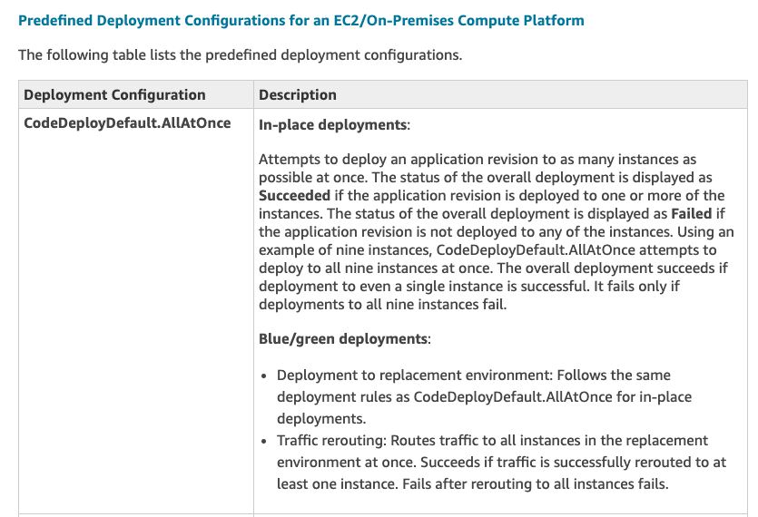
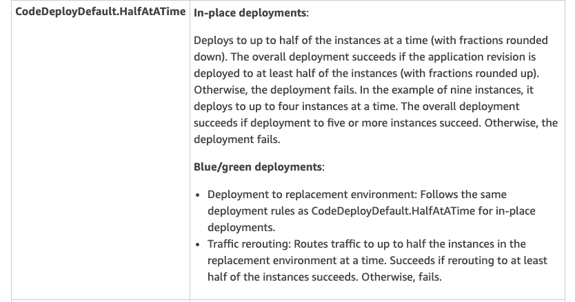
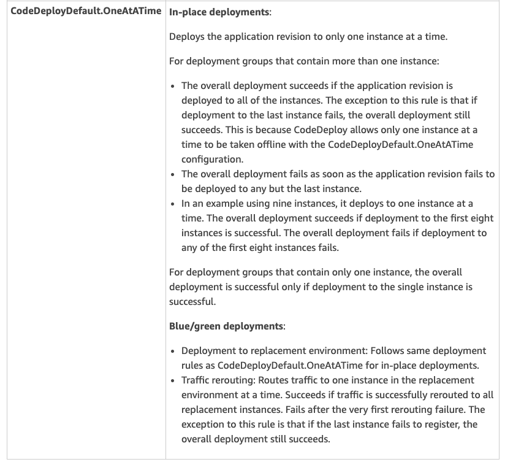
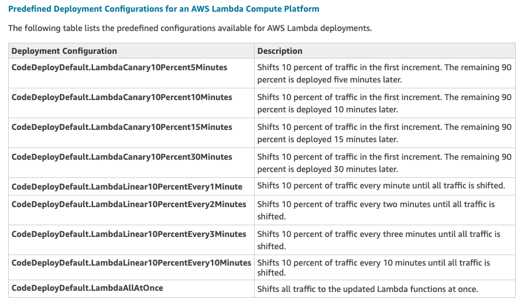
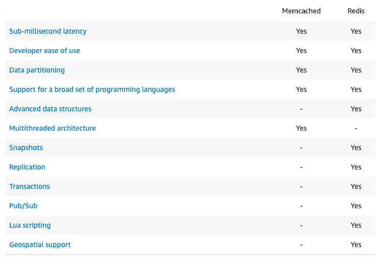
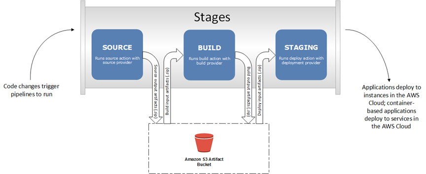

# aws-cert-dva-c01

A braindump for the AWS Developer Associate exam. Not exhaustive, but avoids non-essentials.

<!-- vim-markdown-toc GFM -->

* [AWS IAM](#aws-iam)
* [AWS Security Groups](#aws-security-groups)
* [AWS Cloudformation](#aws-cloudformation)
* [Elastic Beanstalk](#elastic-beanstalk)
* [AWS ECS](#aws-ecs)
* [AWS ECR](#aws-ecr)
* [X-Ray on ECS](#x-ray-on-ecs)
* [AWS EC2](#aws-ec2)
* [VPC](#vpc)
* [AWS DNS](#aws-dns)
* [AWS Elastic IP](#aws-elastic-ip)
* [AWS EBS](#aws-ebs)
* [AWS EFS](#aws-efs)
* [AWS RDS](#aws-rds)
* [AWS CodeDeploy](#aws-codedeploy)
* [AWS S3](#aws-s3)
* [AWS Cognito](#aws-cognito)
* [AWS Kinesis](#aws-kinesis)
* [AWS DynamoDB](#aws-dynamodb)
* [ElastiCache](#elasticache)
* [AWS System Parameter Store](#aws-system-parameter-store)
* [API Gateway](#api-gateway)
* [AWS KMS](#aws-kms)
* [AWS Lambda](#aws-lambda)
* [AWS Step Functions](#aws-step-functions)
* [AWS Secrets Manager](#aws-secrets-manager)
* [AWS Data Pipeline](#aws-data-pipeline)
* [AWS X-ray](#aws-x-ray)
* [AWS Quicksight](#aws-quicksight)
* [AWS Batch](#aws-batch)
* [AWS SQS](#aws-sqs)
* [AWS SNS](#aws-sns)
* [AWS CloudWatch](#aws-cloudwatch)
* [AWS CodeCommit](#aws-codecommit)
* [AWS CodePipeline](#aws-codepipeline)

<!-- vim-markdown-toc -->

## AWS IAM

[Link to AWS](https://docs.aws.amazon.com/IAM/latest/UserGuide/id.html)


### IAM Users

The IAM user represents the person or service who uses the IAM user to interact with AWS. A primary use for IAM users is to give people the ability to sign in to the AWS Management Console for interactive tasks and to make programmatic requests to AWS services using the API or CLI. A user in AWS consists of a name, a password to sign into the AWS Management Console, and up to two access keys that can be used with the API or CLI. When you create an IAM user, you grant it permissions by making it a member of a group that has appropriate permission policies attached (recommended), or by directly attaching policies to the user.

### IAM Groups

An IAM group is a collection of IAM users. You can use groups to specify permissions for a collection of users, which can make those permissions easier to manage for those users. For example, you could have a group called Admins and give that group the types of permissions that administrators typically need. Any user in that group automatically has the permissions that are assigned to the group.

### IAM Roles

An IAM role is very similar to a user, in that it is an identity with permission policies that determine what the identity can and cannot do in AWS. However, a role does not have any credentials (password or access keys) associated with it. Instead of being uniquely associated with one person, a role is intended to be assumable by anyone who needs it.

A role can be assigned to a federated user who signs in by using an external identity provider instead of IAM. AWS uses details passed by the identity provider to determine which role is mapped to the federated user.

### Policies and Permissions 

You manage access in AWS by **creating policies and attaching them to IAM identities (users, groups of users, or roles) or AWS resources**. A policy is an object in AWS that, when associated with an identity or resource, defines their permissions. AWS evaluates these policies when a principal entity (user or role) makes a request. Permissions in the policies determine whether the request is allowed or denied. Most policies are stored in AWS as JSON documents. AWS supports six types of policies: identity-based policies, resource-based policies, permissions boundaries, Organizations SCPs, ACLs, and session policies.

### Temporary credentials

Temporary credentials are primarily used with IAM roles, but there are also other uses. You can request temporary credentials that have a more restricted set of permissions than your standard IAM user. This prevents you from accidentally performing tasks that are not permitted by the more restricted credentials.

## AWS Security Groups

A security group acts as a virtual firewall that controls the traffic for one or more instances. When you launch an instance, you can specify one or more security groups; otherwise, we use the default security group. You can add rules to each security group that allow traffic to or from its associated instances. 

- By default, security groups allow all outbound traffic.
- Security group rules are always permissive; you can't create rules that deny access.
- Security groups are stateful — if you send a request from your instance, the response traffic for that request is allowed to flow in regardless of inbound security group rules
- You can add and remove rules at any time. Your changes are automatically applied to the instances associated with the security group.

> Note: if your application is not accessible (it times out), it might be because of a security group issue.

For each rule, you specify the following:

- Protocol: The protocol to allow. The most common protocols are 6 (TCP) 17 (UDP), and 1 (ICMP).
- Port range : For TCP, UDP, or a custom protocol, the range of ports to allow. You can specify a single port number (for example, 22), or range of port numbers (for example, 7000-8000).
- ICMP type and code: For ICMP, the ICMP type and code.
- Source or destination: The source (inbound rules) or destination (outbound rules) for the traffic. Specify one of these options:
- (Optional) Description

## AWS Cloudformation

[Link to AWS](https://docs.aws.amazon.com/AWSCloudFormation/latest/UserGuide/GettingStarted.html)

### What is AWS CloudFormation? 

AWS CloudFormation is a service that gives developers and businesses an easy way to **create a collection of related AWS resources** and provision them in an orderly and predictable fashion.

### Concepts

AWS CloudFormation introduces two concepts:
- The **template**, a JSON or YAML-format, text-based file that describes all the AWS resources you need to deploy to run your application and
- the **stack**, the set of AWS resources that are created and managed as a single unit when AWS CloudFormation instantiates a template.

### How is AWS CloudFormation different from AWS Elastic Beanstalk?

These services are designed to complement each other. AWS Elastic Beanstalk provides an environment to easily deploy and run applications in the cloud. It is integrated with developer tools and provides a one-stop experience for you to manage the lifecycle of your applications. AWS CloudFormation is a convenient provisioning mechanism for a broad range of AWS resources. It supports the infrastructure needs of many different types of applications such as existing enterprise applications, legacy applications, applications built using a variety of AWS resources and container-based solutions (including those built using AWS Elastic Beanstalk).

AWS CloudFormation supports Elastic Beanstalk application environments as one of the AWS resource types. This allows you, for example, to create and manage an AWS Elastic Beanstalk–hosted application along with an RDS database to store the application data. In addition to RDS instances, any other supported AWS resource can be added to the group as well.

### What are the elements of an AWS CloudFormation template?

1. An optional list of template **parameters** (input values supplied at stack creation time)

2. An optional list of **output values** (e.g. the complete URL to a web application)

3. An optional list of data tables used to lookup static configuration values (e.g., AMI names)

4. The list of AWS **resources** and their configuration values

5. A template file format version number

With parameters, you can customize aspects of your template at run time, when the stack is built. For example, the Amazon RDS database size, Amazon EC2 instance types, database and web server port numbers can be passed to AWS CloudFormation when a stack is created. Each parameter can have a default value and description and may be marked as “NoEcho” in order to hide the actual value you enter on the screen and in the AWS CloudFormation event logs. When you create an AWS CloudFormation stack, the AWS Management Console will automatically synthesize and present a pop-up dialog form for you to edit parameter values.

Output values are a very convenient way to present a stack’s key resources (such as the address of an Elastic Load Balancing load balancer or Amazon RDS database) to the user via the AWS Management Console, or the command line tools. You can use simple functions to concatenate string literals and value of attributes associated with the actual AWS resources.

The following example shows a YAML-formatted template fragment.

```
---
AWSTemplateFormatVersion: "version date"  # optional - The AWS CloudFormation template version that the template conforms to.

Description:
  String  # optional - A text string that describes the template

Metadata:
  template metadata  # optional - Objects that provide additional information about the template.

Parameters:
  set of parameters
  # Values to pass to your template at runtime (when you create or update a stack).
  # You can refer to parameters from the Resources and Outputs sections of the template.

Mappings:
  set of mappings
  # A mapping of keys and associated values
  # that you can use to specify conditional parameter values, similar to a lookup table.
  # You can match a key to a corresponding value 
  # by using the Fn::FindInMap intrinsic function in the Resources and Outputs sections.

Conditions:
  set of conditions
  # Conditions that control whether certain resources are created 
  # or whether certain resource properties are assigned a value during stack creation or update.

Transform:
  set of transforms

Resources:
  set of resources - required
  # Specifies the stack resources and their properties, 
  # such as an Amazon Elastic Compute Cloud instance or an Amazon Simple Storage Service bucket. 
  # You can refer to resources in the Resources and Outputs sections of the template.

Outputs:
  set of outputs
```

### Functions

AWS CloudFormation provides several built-in functions that help you manage your stacks. Use intrinsic functions in your templates to assign values to properties that are not available until runtime.

- `Ref` - returns the value of the specified `parameter` or `resource` (the physical ID of the resource or the value of the parameter.)
- `Fn::GetAtt` - returns the value of an attribute from a resource in the template
- `Fn::FindInMap` - returns the value corresponding to keys in a two-level map that is declared in the `Mappings` section.
- `Fn::ImportValue` - returns the value of an output exported by another stack. You typically use this function to create cross-stack references.
- `Fn::Join` - appends a set of values into a single value, separated by the specified delimiter.
- `Fn::Sub` - substitutes variables in an input string with values that you specify. In your templates, you can use this function to construct commands or outputs that include values that aren't available until you create or update a stack.
- Condition Functions (`Fn::If`, `Fn::Not`, `Fn::Equals`, etc.)
- `Fn::Transform`

### Transform

The optional `Transform` section specifies one or more macros that AWS CloudFormation uses to process your template. The Transform section builds on the simple, declarative language of AWS CloudFormation with a powerful macro system.

### Stacksets

AWS CloudFormation StackSets extends the functionality of stacks by enabling you to create, update, or delete stacks across multiple accounts and regions with a single operation. 

## Elastic Beanstalk 

[Link to AWS](https://docs.aws.amazon.com/elasticbeanstalk/latest/dg/Welcome.html)

### Create an Application Source Bundle

When you use the AWS Elastic Beanstalk console to deploy a new application or an application version, you'll need to upload a source bundle. Your source bundle must meet the following requirements:

- Consist of a single ZIP file or WAR file (you can include multiple WAR files inside your ZIP file)
- Not exceed 512 MB
- Not include a parent folder or top-level directory (subdirectories are fine)

If you want to deploy a worker application that processes periodic background tasks, your application source bundle must also include a `cron.yaml` file.

### Config files

You can add AWS Elastic Beanstalk configuration files (`.ebextensions`) to your web application's source code to configure your environment and customize the AWS resources that it contains. Configuration files are YAML- or JSON-formatted documents with a `.config` file extension that you place in a folder named .ebextensions and deploy in your application source bundle.

### Custom scripts and programs 

When you create an AWS Elastic Beanstalk environment, you can specify an Amazon Machine Image (AMI) to use instead of the standard Elastic Beanstalk AMI included in your platform configuration's solution stack. A custom AMI can improve provisioning times when instances are launched in your environment if you need to install a lot of software that isn't included in the standard AMIs.

Using configuration files is great for configuring and customizing your environment quickly and consistently. Applying configurations, however, can start to take a long time during environment creation and updates. If you do a lot of server configuration in configuration files, you can reduce this time by making a custom AMI that already has the software and configuration that you need

### Versions

#### Managing Application Versions

Elastic Beanstalk creates an application version whenever you upload source code. This usually occurs when you create an environment or upload and deploy code using the environment management console or EB CLI. Elastic Beanstalk deletes these application versions according to the application's lifecycle policy and when you delete the application.

### Deployments 


## AWS ECS

[Link to AWS](https://docs.aws.amazon.com/AmazonECS/latest/developerguide/Welcome.html)

Amazon Elastic Container Service (Amazon ECS) is a highly scalable, high-performance container orchestration service that supports Docker containers and allows you to easily run and scale containerized applications on AWS.

### I want to launch containers. Why do I have to launch Tasks?

Docker encourages you to split your applications up into their individual components, and Elastic Container Service is optimized for this pattern. Tasks allow you to define a set of containers that you would like to be placed together (or part of the same placement decision), their properties, and how they may be linked. Tasks include all the information that Amazon ECS needs to make the placement decision. To launch a single container, your Task Definition should only include one container definition.

### Launch types

The **EC2 launch type** allows you to run your containerized applications on a cluster of Amazon EC2 instances that you manage.

The **Fargate launch type** allows you to run your containerized applications without the need to provision and manage the backend infrastructure. Just register your task definition and Fargate launches the container for you.

### Task Placement

When a task that uses the EC2 launch type is launched, Amazon ECS must determine where to place the task based on the requirements specified in the task definition, such as CPU and memory. Similarly, when you scale down the task count, Amazon ECS must determine which tasks to terminate. You can apply task placement strategies and constraints to customize how Amazon ECS places and terminates tasks. 

### Task Groups

You can identify a set of related tasks as a task group. All tasks with the same task group name are considered as a set when performing spread placement. For example, suppose that you are running different applications in one cluster, such as databases and web servers. To ensure that your databases are balanced across Availability Zones, add them to a task group named "databases" and then use this task group as a constraint for task placement.

#### Task Placement Strategies

A **task placement strategy** is an algorithm for selecting instances for task placement or tasks for termination. Task placement strategies can be specified when either running a task or creating a new service.

Strategy Types
Amazon ECS supports the following task placement strategies:

- `binpack` - Place tasks based on the least available amount of CPU or memory. This minimizes the number of instances in use.
- `random` - Place tasks randomly.
- `spread` - Place tasks evenly based on the specified value. Accepted values are instanceId (or host, which has the same effect), or any platform or custom attribute that is applied to a container instance, such as attribute:ecs.availability-zone. Service tasks are spread based on the tasks from that service. Standalone tasks are spread based on the tasks from the same task group.

## AWS ECR

Amazon Elastic Container Registry (Amazon ECR) is a managed AWS Docker registry service that is secure, scalable, and reliable. Amazon ECR supports private Docker repositories with resource-based permissions using AWS IAM so that specific users or Amazon EC2 instances can access repositories and images. Developers can use the Docker CLI to push, pull, and manage images.

## X-Ray on ECS

### Running the X-Ray daemon on Amazon ECS

In Amazon ECS, create a Docker image that runs the X-Ray daemon, upload it to a Docker image repository, and then deploy it to your Amazon ECS cluster. You can use port mappings and network mode settings in your task definition file to allow your application to communicate with the daemon container.

## AWS EC2

Amazon EC2 provides the following features:

- Virtual computing environments, known as instances
- Preconfigured templates for your instances, known as Amazon Machine Images (AMIs), that package the bits you need for your server (including the operating system and additional software)
- Various configurations of CPU, memory, storage, and networking capacity for your instances, known as instance types
- Secure login information for your instances using key pairs (AWS stores the public key, and you store the private key in a secure place)
- Storage volumes for temporary data that's deleted when you stop or terminate your instance, known as instance store volumes
- Persistent storage volumes for your data using Amazon Elastic Block Store (Amazon EBS), known as Amazon EBS volumes
- Multiple physical locations for your resources, such as instances and Amazon EBS volumes, known as Regions and Availability Zones
- A firewall that enables you to specify the protocols, ports, and source IP ranges that can reach your instances using security groups
- Static IPv4 addresses for dynamic cloud computing, known as Elastic IP addresses
- Metadata, known as tags, that you can create and assign to your Amazon EC2 resources
- Virtual networks you can create that are logically isolated from the rest of the AWS cloud, and that you can optionally connect to your own network, known as virtual private clouds (VPCs)

### Tenancy types

Amazon EC2 provides the following purchasing options to enable you to optimize your costs based on your needs:

- **On-Demand** Instances – Pay, by the second, for the instances that you launch.
- **Reserved** Instances – Purchase, at a significant discount, instances that are always available, for a term from one to three years.
- **Scheduled** Instances – Purchase instances that are always available on the specified recurring schedule, for a one-year term.
- **Spot** Instances – Request unused EC2 instances, which can lower your Amazon EC2 costs significantly.
- **Dedicated Hosts** – Pay for a physical host that is fully dedicated to running your instances, and bring your existing per-socket, per-core, or per-VM software licenses to reduce costs.
- **Dedicated Instances** – Pay, by the hour, for instances that run on single-tenant hardware.
- **Capacity Reservations** – Reserve capacity for your EC2 instances in a specific Availability Zone for any duration.

## VPC 

[Link to AWS](https://docs.aws.amazon.com/vpc/latest/userguide/what-is-amazon-vpc.html)

###  What are the components of Amazon VPC?

Amazon VPC comprises a variety of objects that will be familiar to customers with existing networks:

- A **Virtual Private Cloud**: A logically isolated virtual network in the AWS cloud. You define a VPC’s IP address space from ranges you select.
- **Subnet**: A segment of a VPC’s IP address range where you can place groups of isolated resources.
- **Internet Gateway**: The Amazon VPC side of a connection to the public Internet.
- **NAT Gateway**: A highly available, managed Network Address Translation (NAT) service for your resources in a private subnet to access the Internet.
- **Virtual private gateway**: The Amazon VPC side of a VPN connection.
- **Peering Connection**: A peering connection enables you to route traffic via private IP addresses between two peered VPCs.
- **VPC Endpoints**: Enables private connectivity to services hosted in AWS, from within your VPC without using an Internet Gateway, VPN, Network Address Translation (NAT) devices, or firewall proxies.
- **Egress-only Internet Gateway**: A stateful gateway to provide egress only access for IPv6 traffic from the VPC to the Internet.
    
### How do I get started with Amazon VPC?
 
Your AWS resources are automatically provisioned in a ready-to-use default VPC. You can choose to create additional VPCs by going to the Amazon VPC page in the AWS Management Console and selecting "Start VPC Wizard".
 
You’ll be presented with four basic options for network architectures. After selecting an option, you can modify the size and IP address range of the VPC and its subnets. If you select an option with Hardware VPN Access, you will need to specify the IP address of the VPN hardware on your network. You can modify the VPC to add or remove secondary IP ranges and gateways, or add more subnets to IP ranges.
 
The four options are:

- Amazon VPC with a single public subnet only
- Amazon VPC with public and private subnets
- Amazon VPC with public and private subnets and AWS Site-to-Site VPN access
- Amazon VPC with a private subnet only and AWS Site-to-Site VPN access

### VPC and Subnets

https://docs.aws.amazon.com/vpc/latest/userguide/VPC_Subnets.html

A virtual private cloud (VPC) is a virtual network dedicated to your AWS account. It is logically isolated from other virtual networks in the AWS Cloud. You can launch your AWS resources, such as Amazon EC2 instances, into your VPC.

When you create a VPC, you must specify a range of IPv4 addresses for the VPC in the form of a Classless Inter-Domain Routing (CIDR) block; for example, 10.0.0.0/16. This is the primary CIDR block for your VPC.

A VPC spans all the Availability Zones in the region. After creating a VPC, you can add one or more subnets in each Availability Zone. When you create a subnet, you specify the CIDR block for the subnet, which is a subset of the VPC CIDR block. Each subnet must reside entirely within one Availability Zone and cannot span zones. Availability Zones are distinct locations that are engineered to be isolated from failures in other Availability Zones. By launching instances in separate Availability Zones, you can protect your applications from the failure of a single location. We assign a unique ID to each subnet.

You can also optionally assign an IPv6 CIDR block to your VPC, and assign IPv6 CIDR blocks to your subnets. 

### Endpoints

A VPC endpoint enables you to privately connect your VPC to supported AWS services and VPC endpoint services powered by PrivateLink without requiring an internet gateway, NAT device, VPN connection, or AWS Direct Connect connection. Instances in your VPC do not require public IP addresses to communicate with resources in the service. Traffic between your VPC and the other service does not leave the Amazon network.

Endpoints are virtual devices. They are horizontally scaled, redundant, and highly available VPC components that allow communication between instances in your VPC and services without imposing availability risks or bandwidth constraints on your network traffic.

### Flow logs

VPC Flow Logs is a feature that enables you to **capture information about the IP traffic** going to and from network interfaces in your VPC. Flow log data can be published to Amazon CloudWatch Logs and Amazon S3. After you've created a flow log, you can retrieve and view its data in the chosen destination.

Flow logs can help you with a number of tasks, such as:

- Diagnosing overly restrictive security group rules
- Monitoring the traffic that is reaching your instance
- Determining the direction of the traffic to and from the network interfaces

### VPC Peering

[Link to AWS](https://docs.aws.amazon.com/vpc/latest/peering/what-is-vpc-peering.html)

A VPC peering connection is a networking connection between two VPCs that enables you to route traffic between them using private IPv4 addresses or IPv6 addresses. Instances in either VPC can communicate with each other as if they are within the same network. You can create a VPC peering connection between your own VPCs, or with a VPC in another AWS account. The VPCs can be in different regions (also known as an inter-region VPC peering connection).


AWS uses the existing infrastructure of a VPC to create a VPC peering connection; it is neither a gateway nor a VPN connection, and does not rely on a separate piece of physical hardware. There is no single point of failure for communication or a bandwidth bottleneck.

## AWS DNS

[Link to AWS](https://aws.amazon.com/route53/)

### What is the difference between a Domain and a Hosted Zone?

A domain is a general DNS concept. Domain names are easily recognizable names for numerically addressed Internet resources. For example, amazon.com is a domain. A hosted zone is an Amazon Route 53 concept. A hosted zone is analogous to a traditional DNS zone file; it represents a collection of records that can be managed together, belonging to a single parent domain name. All resource record sets within a hosted zone must have the hosted zone’s domain name as a suffix. For example, the amazon.com hosted zone may contain records named www.amazon.com, and www.aws.amazon.com, but not a record named www.amazon.ca.

### What is DNS Failover?

DNS Failover consists of two components: **health checks** and **failover**. Health checks are automated requests sent over the Internet to your application to verify that your application is reachable, available, and functional. You can configure the health checks to be similar to the typical requests made by your users, such as requesting a web page from a specific URL. With DNS failover, Route 53 only returns answers for resources that are healthy and reachable from the outside world, so that your end users are routed away from a failed or unhealthy part of your application.

### Does DNS Failover support Elastic Load Balancers (ELBs) as endpoints?

Yes, you can configure DNS Failover for Elastic Load Balancers (ELBs). To enable DNS Failover for an ELB endpoint, create an Alias record pointing to the ELB and set the “Evaluate Target Health” parameter to true. Route 53 creates and manages the health checks for your ELB automatically. You do not need to create your own Route 53 health check of the ELB.

## AWS Elastic IP

[Link to AWS](https://docs.aws.amazon.com/AWSEC2/latest/UserGuide/elastic-ip-addresses-eip.html)

An Elastic IP address is a static IPv4 address designed for dynamic cloud computing. An Elastic IP address is associated with your AWS account. With an Elastic IP address, you can mask the failure of an instance or software by rapidly remapping the address to another instance in your account.

An Elastic IP address is a public IPv4 address, which is reachable from the internet. If your instance does not have a public IPv4 address, you can associate an Elastic IP address with your instance to enable communication with the internet; for example, to connect to your instance from your local computer.

- To use an Elastic IP address, you first allocate one to your account, and then associate it with your instance or a network interface.
- An Elastic IP address is for use in a specific Region only.
- When you associate an Elastic IP address with an instance that previously had a public IPv4 address, the public DNS hostname of the instance changes to match the Elastic IP address.
- We resolve a public DNS hostname to the public IPv4 address or the Elastic IP address of the instance outside the network of the instance, and to the private IPv4 address of the instance from within the network of the instance.
- To ensure efficient use of Elastic IP addresses, we impose a small hourly charge if an Elastic IP address is not associated with a running instance, or if it is associated with a stopped instance or an unattached network interface. While your instance is running, you are not charged for one Elastic IP address associated with the instance, but you are charged for any additional Elastic IP addresses associated with the instance.
- You can only have 5 Elastic IP in your account (you can ask AWS to increase that).
- Overall, try to avoid using Elastic IP:
  - They often reflect poor architectural decisions
  - Instead, use a random public IP and register a DNS name to it

## AWS EBS

[Link to AWS](https://docs.aws.amazon.com/AWSEC2/latest/UserGuide/AmazonEBS.html)

Amazon Elastic Block Store (Amazon EBS) provides block level storage volumes for use with EC2 instances. EBS volumes behave like raw, unformatted block devices. You can mount these volumes as devices on your instances. You can mount multiple volumes on the same instance, but each volume can be attached to only one instance at a time. You can create a file system on top of these volumes, or use them in any way you would use a block device (like a hard drive). You can dynamically change the configuration of a volume attached to an instance.

Amazon EBS is recommended when data must be quickly accessible and requires long-term persistence. EBS volumes are particularly well-suited for use as the primary storage for file systems, databases, or for any applications that require fine granular updates and access to raw, unformatted, block-level storage. Amazon EBS is well suited to both database-style applications that rely on random reads and writes, and to throughput-intensive applications that perform long, continuous reads and writes.

### Snapshots

You can back up the data on your Amazon EBS volumes to Amazon S3 by taking point-in-time snapshots. Snapshots are incremental backups, which means that only the blocks on the device that have changed after your most recent snapshot are saved. This minimizes the time required to create the snapshot and saves on storage costs by not duplicating data. When you delete a snapshot, only the data unique to that snapshot is removed. Each snapshot contains all of the information that is needed to restore your data (from the moment when the snapshot was taken) to a new EBS volume.

Multi-Volume Snapshots

Snapshots can be used to create a backup of critical workloads, such as a large database or a file system that spans across multiple EBS volumes. Multi-volume snapshots allow you to take exact point-in-time, data coordinated, and crash-consistent snapshots across multiple EBS volumes attached to an EC2 instance. 

## AWS EFS

EFS provides shared access to fully managed file systems across-the-board. Connecting to EFS is similar to connecting to your network drive since it supports NFS protocols, which are standard for network attached storage (NAS) devices. As a result, you can connect to it through your network interface.

https://n2ws.com/blog/ebs-snapshot/aws-fast-storage-efs-vs-ebs

## AWS RDS

> TODO: read replicas

[Link to AWS](https://docs.aws.amazon.com/AmazonRDS/latest/UserGuide/Welcome.html)

Amazon Relational Database Service (Amazon RDS) is a web service that makes it easier to set up, operate, and scale a relational database in the AWS Cloud. It provides cost-efficient, resizeable capacity for an industry-standard relational database and manages common database administration tasks.

The basic building block of Amazon RDS is the DB instance. A DB instance is an isolated database environment in the AWS Cloud. Your DB instance can contain multiple user-created databases. You can access your DB instance by using the same tools and applications that you use with a standalone database instance. You can create and modify a DB instance by using the AWS Command Line Interface, the Amazon RDS API, or the AWS Management Console.

Each DB instance runs a DB engine. Amazon RDS currently supports the MySQL, MariaDB, PostgreSQL, Oracle, and Microsoft SQL Server DB engines. Each DB engine has its own supported features, and each version of a DB engine may include specific features. Additionally, each DB engine has a set of parameters in a DB parameter group that control the behavior of the databases that it manages.

The computation and memory capacity of a DB instance is determined by its DB instance class. You can select the DB instance that best meets your needs. If your needs change over time, you can change DB instances.

DB instance storage comes in three types: Magnetic, General Purpose (SSD), and Provisioned IOPS (PIOPS). They differ in performance characteristics and price, allowing you to tailor your storage performance and cost to the needs of your database.

You can run your DB instance in several Availability Zones, an option called a Multi-AZ deployment. When you choose this option, Amazon automatically provisions and maintains a secondary standby DB instance in a different Availability Zone. Your primary DB instance is synchronously replicated across Availability Zones to the secondary instance. 

A security group controls the access to a DB instance. It does so by allowing access to IP address ranges or Amazon EC2 instances that you specify.

### Connecting to an RDS instance

https://docs.aws.amazon.com/AmazonRDS/latest/UserGuide/USER_VPC.Scenarios.html

https://docs.aws.amazon.com/AmazonRDS/latest/UserGuide/CHAP_Tutorials.WebServerDB.CreateVPC.html

### Monitoring

Monitoring Tools

AWS provides various tools that you can use to monitor Amazon RDS. You can configure some of these tools to do the monitoring for you, while some of the tools require manual intervention. We recommend that you automate monitoring tasks as much as possible.

#### Automated Monitoring Tools

You can use the following automated monitoring tools to watch Amazon RDS and report when something is wrong:

**Amazon RDS Events** – Subscribe to Amazon RDS events to be notified when changes occur with a DB instance, DB snapshot, DB parameter group, or DB security group. 

**Database log files** – View, download, or watch database log files using the Amazon RDS console or Amazon RDS API operations. You can also query some database log files that are loaded into database tables. 

**Amazon RDS Enhanced Monitoring** — Look at metrics in real time for the operating system. Enhanced Monitoring metrics are useful when you want to see how different processes or threads on a DB instance use the CPU.

In addition, Amazon RDS integrates with Amazon CloudWatch for additional monitoring capabilities:

Amazon CloudWatch Metrics – Amazon RDS automatically sends metrics to CloudWatch every minute for each active database. You are not charged additionally for Amazon RDS metrics in CloudWatch. 

Amazon CloudWatch Alarms – You can watch a single Amazon RDS metric over a specific time period, and perform one or more actions based on the value of the metric relative to a threshold you set. 

**Amazon CloudWatch Logs** – Most DB engines enable you to monitor, store, and access your database log files in CloudWatch Logs. 

Manual Monitoring Tools  
Another important part of monitoring Amazon RDS involves manually monitoring those items that the CloudWatch alarms don't cover. The Amazon RDS, CloudWatch, AWS Trusted Advisor and other AWS console dashboards provide an at-a-glance view of the state of your AWS environment. We recommend that you also check the log files on your DB instance.

From the Amazon RDS console, you can monitor the following items for your resources:

- The number of connections to a DB instance
- The amount of read and write operations to a DB instance
- The amount of storage that a DB instance is currently utilizing
- The amount of memory and CPU being utilized for a DB instance
- The amount of network traffic to and from a DB instance

From the AWS Trusted Advisor dashboard, you can review the following cost optimization, security, fault tolerance, and performance improvement checks:

- Amazon RDS Idle DB Instances
- Amazon RDS Security Group Access Risk
- Amazon RDS Backups
- Amazon RDS Multi-AZ
- 
- CloudWatch home page shows:
- Current alarms and status
- Graphs of alarms and resources
- Service health status

In addition, you can use CloudWatch to do the following:

- Create customized dashboards to monitor the services you care about
- Graph metric data to troubleshoot issues and discover trends
- Search and browse all your AWS resource metrics
- Create and edit alarms to be notified of problems

### MySQL encryption - TDE

Amazon RDS supports using *Transparent Data Encryption (TDE)* to encrypt stored data on your DB instances running Microsoft SQL Server. TDE automatically encrypts data before it is written to storage, and automatically decrypts data when the data is read from storage.


### MySQL Database Log Files

You can monitor the MySQL **error log**, **slow query log**, and the **general log**. The MySQL error log is generated by default; you can generate the slow query and general logs by setting parameters in your DB parameter group. Amazon RDS rotates all of the MySQL log files; the intervals for each type are given following.

## AWS CodeDeploy 

CodeDeploy is a deployment service that automates application deployments to Amazon EC2 instances, on-premises instances, serverless Lambda functions, or Amazon ECS services.

Primary components:
- **Application**: A name that uniquely identifies the application you want to deploy. CodeDeploy uses this name, which functions as a container, to ensure the correct combination of revision, deployment configuration, and deployment group are referenced during a deployment.
- **Compute platform**: The platform on which CodeDeploy deploys an application (**EC2/On-Premises**, **AWS Lambda**, **ECS**),
- **Deployment configuration**: A set of deployment rules and deployment success and failure conditions used by CodeDeploy during a deployment. If your deployment uses the EC2/On-Premises compute platform, you can specify the minimum number of healthy instances for the deployment (`MinimumHealthyHosts` in CloudFormation template). If your deployment uses the AWS Lambda compute platform, you can specify how traffic is routed to your updated Lambda function versions (canary, linear, all-at-once).
- **Deployment group**: A set of individual instances
- **Deployment type**: The method used to make the latest application revision available on instances in a deployment group (In-place deployment vs Blue/green deployment).
- **IAM instance profile**: An IAM role that you attach to your Amazon EC2 instances. This profile includes the permissions required to access the Amazon S3 buckets or GitHub repositories where the applications are stored.
- **Revision**: An AWS Lambda deployment revision is a YAML- or JSON-formatted file that specifies information about the Lambda function to deploy. An EC2/On-Premises deployment revision is an archive file that contains source content (source code, webpages, executable files, and deployment scripts) and an application specification file (AppSpec file)
- **Service role**: An IAM role that grants permissions to an AWS service so it can access AWS resources. 
- **Target revision**: The most recent version of the application revision that you have uploaded to your repository and want to deploy to the instances in a deployment group. In other words, the application revision currently targeted for deployment.

### Repositories

CodeDeploy currently supports the following repository types: S3, GitHub, BitBucket.

### Deployment configurations

#### EC2 / On-premise

When you deploy to an EC2/On-Premises compute platform, the deployment configuration specifies, through the use of a minimum healthy hosts value, the number or percentage of instances that must remain available at any time during a deployment.

You can use one of the three predefined deployment configurations provided by AWS or create a custom deployment configuration. If you don't specify a deployment configuration, CodeDeploy uses the CodeDeployDefault.OneAtATime deployment configuration.





#### ECS Compute Platform deployment options

When you deploy to an Amazon ECS compute platform, the deployment configuration specifies how traffic is shifted to the updated Amazon ECS container. Amazon ECS deployments support one deployment configuration.

`CodeDeployDefault.ECSAllAtOnce`: Shifts all traffic to the updated Amazon ECS container at once.


#### Lambda deployment options



### Sequence of Hooks

#### Lambda Function Version Deployment

In a serverless Lambda function version deployment, event hooks run in the following order:


#### EC2 - In-place deployments

In an in-place deployment, including the rollback of an in-place deployment, event hooks are run in the following order:


https://docs.aws.amazon.com/codedeploy/latest/userguide/reference-appspec-file-structure-hooks.html#reference-appspec-file-structure-hooks-run-order-ecs

#### EC2 - Blue/green deployments

In a blue/green deployment, event hooks are run in the following order:


### Deployment, Rollback, Redeployment

https://docs.aws.amazon.com/codedeploy/latest/userguide/deployments-rollback-and-redeploy.html

#### Deployment monitorin & automatic rollback

You can now monitor and automatically react to changes in your AWS CodeDeploy deployments using Amazon CloudWatch alarms. Amazon CloudWatch is a monitoring service for AWS cloud resources and the applications you run on AWS. Using CloudWatch with CodeDeploy, you can monitor metrics for Amazon EC2 instances or Auto Scaling groups being managed by CodeDeploy and then invoke an action if the metric you are tracking crosses a certain threshold for a defined period of time. You can monitor metrics such as instance CPU utilization. If the alarm is activated, CloudWatch initiates actions such as sending a notification to Amazon Simple Notification Service, stopping a CodeDeploy deployment, or changing the state of an instance (e.g. reboot, terminate, recover).

CodeDeploy now also lets you automatically roll back a deployment when a deployment fails or when a CloudWatch alarm is activated. CodeDeploy will redeploy the last known working version of the application when it rolls back. Previously, you needed to manually initiate a deployment if you wanted to roll back a deployment. You can configure automatic rollback settings when creating a new deployment or by updating an existing deployment. Learn more about this feature in our documentation.

## AWS S3 

### Best practices

Amazon S3 automatically scales to high request rates. For example, your application can achieve at least 3,500 PUT/COPY/POST/DELETE and 5,500 GET/HEAD requests per second per prefix in a bucket. There are no limits to the number of prefixes in a bucket.

### Consistency

Amazon S3 provides **read-after-write consistency** for PUTS of new objects in your S3 bucket in all Regions with one caveat. The caveat is that if you make a HEAD or GET request to the key name (to find if the object exists) before creating the object, Amazon S3 provides eventual consistency for read-after-write.

Amazon S3 offers eventual consistency for overwrite PUTS and DELETES in all Regions.

Updates to a single key are atomic. For example, if you PUT to an existing key, a subsequent read might return the old data or the updated data, but it never returns corrupted or partial data.

Amazon S3 achieves high availability by replicating data across multiple servers within AWS data centers. If a PUT request is successful, your data is safely stored. However, information about the changes must replicate across Amazon S3, which can take some time, and so you might observe the following behaviors:

- A process writes a new object to Amazon S3 and immediately lists keys within its bucket. Until the change is fully propagated, the object might not appear in the list.
- A process replaces an existing object and immediately tries to read it. Until the change is fully propagated, Amazon S3 might return the previous data.
- A process deletes an existing object and immediately tries to read it. Until the deletion is fully propagated, Amazon S3 might return the deleted data.
- A process deletes an existing object and immediately lists keys within its bucket. Until the deletion is fully propagated, Amazon S3 might list the deleted object.


### Requiring HTTPS for Communication Between CloudFront and Your Amazon S3 Origin

When your origin is an Amazon S3 bucket, your options for using HTTPS for communications with CloudFront depend on how you're using the bucket. If your Amazon S3 bucket is configured as a website endpoint, you can't configure CloudFront to use HTTPS to communicate with your origin because Amazon S3 doesn't support HTTPS connections in that configuration.

When your origin is an Amazon S3 bucket that supports HTTPS communication, CloudFront always forwards requests to S3 by using the protocol that viewers used to submit the requests. The default setting for the Origin Protocol Policy setting is Match Viewer and can't be changed.

If you want to require HTTPS for communication between CloudFront and Amazon S3, you must change the value of Viewer Protocol Policy to Redirect HTTP to HTTPS or HTTPS Only. The procedure later in this section explains how to use the CloudFront console to change Viewer Protocol Policy. For information about using the CloudFront API to update the ViewerProtocolPolicy element for a web distribution, see UpdateDistribution in the Amazon CloudFront API Reference. 

### Cross Region Replication

Cross-region replication (CRR) enables automatic, asynchronous copying of objects across buckets in different AWS Regions. Buckets configured for cross-region replication can be owned by the same AWS account or by different accounts.

Cross-region replication can help you do the following:

- Comply with compliance requirements—Although Amazon S3 stores your data across multiple geographically distant Availability Zones by default, compliance requirements might dictate that you store data at even greater distances. Cross-region replication allows you to replicate data between distant AWS Regions to satisfy these requirements.
- Minimize latency—If your customers are in two geographic locations, you can minimize latency in accessing objects by maintaining object copies in AWS Regions that are geographically closer to your users.
- Increase operational efficiency — If you have compute clusters in two different AWS Regions that analyze the same set of objects, you might choose to maintain object copies in those Regions.
- Maintain object copies under different ownership — Regardless of who owns the source object you can tell Amazon S3 to change replica ownership to the AWS account that owns the destination bucket. This is referred to as the owner override option. You might use this option restrict access to object replicas.

### Policies

By default, all Amazon S3 resources—buckets, objects, and related subresources (for example, lifecycle configuration and website configuration)—are private: only the resource owner, an AWS account that created it, can access the resource. The resource owner can optionally grant access permissions to others by writing an access policy.

Amazon S3 offers access policy options broadly categorized as **resource-based policies** and **user policies**. Access policies you attach to your resources (buckets and objects) are referred to as resource-based policies. For example, bucket policies and access control lists (ACLs) are resource-based policies. You can also attach access policies to users in your account. These are called user policies. You may choose to use resource-based policies, user policies, or some combination of these to manage permissions to your Amazon S3 resources. 

Bucket policy and user policy are two of the access policy options available for you to grant permission to your Amazon S3 resources. Both use JSON-based access policy language.

### Amazon S3 access control lists (ACLs) 

ACLs enable you to manage access to buckets and objects. Each bucket and object has an ACL attached to it as a subresource. It defines which AWS accounts or groups are granted access and the type of access. When a request is received against a resource, Amazon S3 checks the corresponding ACL to verify that the requester has the necessary access permissions.

When you create a bucket or an object, Amazon S3 creates a default ACL that grants the resource owner full control over the resource.

### MFA 

You can enforce the MFA authentication requirement using the aws:MultiFactorAuthAge key in a bucket policy. IAM users can access Amazon S3 resources by using temporary credentials issued by the AWS Security Token Service (STS). You provide the MFA code at the time of the STS request.

### S3 Inventory

Amazon S3 inventory is one of the tools Amazon S3 provides to help manage your storage. You can use it to audit and report on the replication and encryption status of your objects for business, compliance, and regulatory needs. You can also simplify and speed up business workflows and big data jobs using Amazon S3 inventory, which provides a scheduled alternative to the Amazon S3 synchronous List API operation.

### Object lifecycle management

To manage your objects so that they are stored cost effectively throughout their lifecycle, configure their lifecycle. A lifecycle configuration is a set of rules that define actions that Amazon S3 applies to a group of objects. There are two types of actions:

#### Transition actions 

Define when objects transition to another storage class. For example, you might choose to transition objects to the STANDARD_IA storage class 30 days after you created them, or archive objects to the GLACIER storage class one year after creating them.

There are costs associated with the lifecycle transition requests. 

#### Expiration actions

Define when objects expire. Amazon S3 deletes expired objects on your behalf.

The lifecycle expiration costs depend on when you choose to expire objects. 


#### When Should I Use Lifecycle Configuration?

Define lifecycle configuration rules for objects that have a well-defined lifecycle. For example:

If you upload periodic logs to a bucket, your application might need them for a week or a month. After that, you might want to delete them.

Some documents are frequently accessed for a limited period of time. After that, they are infrequently accessed. At some point, you might not need real-time access to them, but your organization or regulations might require you to archive them for a specific period. After that, you can delete them.

You might upload some types of data to Amazon S3 primarily for archival purposes. For example, you might archive digital media, financial and healthcare records, raw genomics sequence data, long-term database backups, and data that must be retained for regulatory compliance.

With lifecycle configuration rules, you can tell Amazon S3 to transition objects to less expensive storage classes, or archive or delete them.

#### How Do I Configure a Lifecycle?

A lifecycle configuration, an XML file, comprises a set of rules with predefined actions that you want Amazon S3 to perform on objects during their lifetime.

Amazon S3 provides a set of API operations for managing lifecycle configuration on a bucket. Amazon S3 stores the configuration as a lifecycle subresource that is attached to your bucket. For details, see the following:

- `PUT` Bucket lifecycle
- `GET` Bucket lifecycle
- `DELETE` Bucket lifecycle

You can also configure the lifecycle by using the Amazon S3 console or programmatically by using the AWS SDK wrapper libraries. If you need to, you can also make the REST API calls directly. 

### Configuring Amazon S3 Event Notifications

The Amazon S3 notification feature enables you to receive notifications when certain events happen in your bucket. To enable notifications, you must first add a notification configuration identifying the events you want Amazon S3 to publish, and the destinations where you want Amazon S3 to send the event notifications. You store this configuration in the notification subresource (see Bucket Configuration Options) associated with a bucket. Amazon S3 provides an API for you to manage this subresource.

https://docs.aws.amazon.com/AmazonS3/latest/dev/NotificationHowTo.html

### S3 Select

Enables applications to retrieve only a subset of data from an object by using simple SQL expressions.

As an example, let’s imagine you’re a developer at a large retailer and you need to analyze the weekly sales data from a single store, but the data for all 200 stores is saved in a new GZIP-ed CSV every day. Without S3 Select, you would need to download, decompress and process the entire CSV to get the data you needed. With S3 Select, you can use a simple SQL expression to return only the data from the store you’re interested in, instead of retrieving the entire object. 


### Amazon S3 Transfer Acceleration

Enables fast, easy, and secure transfers of files over long distances between your client and an S3 bucket. Transfer Acceleration takes advantage of Amazon CloudFront’s globally distributed edge locations. As the data arrives at an edge location, data is routed to Amazon S3 over an optimized network path.

You might want to use Transfer Acceleration on a bucket for various reasons, including the following:

- You have customers that upload to a centralized bucket from all over the world.
- You transfer gigabytes to terabytes of data on a regular basis across continents.
- You are unable to utilize all of your available bandwidth over the Internet when uploading to Amazon S3.


### SSE-C (Server-side encryption with customer provided key),

When using server-side encryption with customer-provided encryption keys (SSE-C), you must provide encryption key information using the following request headers.

- `x-amz-server-side-encryption-customer-algorithm` - Use this header to specify the encryption algorithm. The header value must be "AES256".
- `x-amz-server-side-encryption-customer-key` - Use this header to provide the 256-bit, base64-encoded encryption key for Amazon S3 to use to encrypt or decrypt your data.
- `x-amz-server-side-encryption-customer-key-MD5` - Use this header to provide the base64-encoded 128-bit MD5 digest of the encryption key according to RFC 1321. Amazon S3 uses this header for a message integrity check to ensure that the encryption key was transmitted without error.

### S3 limitations

- Up to 100 buckets per account
- Storage capacity is virtually unlimited
- Can't change a bucket's region after creation


### AWS CloudFront

Amazon CloudFront is a web service that speeds up distribution of your static and dynamic web content, such as .html, .css, .js, and image files, to your users. CloudFront delivers your content through a worldwide network of data centers called edge locations. When a user requests content that you're serving with CloudFront, the user is routed to the edge location that provides the lowest latency (time delay), so that content is delivered with the best possible performance.

If the content is already in the edge location with the lowest latency, CloudFront delivers it immediately.

If the content is not in that edge location, CloudFront retrieves it from an origin that you've defined—such as an Amazon S3 bucket, a MediaPackage channel, or an HTTP server (for example, a web server) that you have identified as the source for the definitive version of your content.

#### Origin failover

You can set up CloudFront with origin failover for scenarios that require high availability. To get started, create an origin group in which you designate a primary origin for CloudFront plus a second origin that CloudFront automatically switches to when the primary origin returns specific HTTP status code failure responses.

To set up origin failover, you must have a distribution with at least two origins

## AWS Cognito 

### User pools & Identity pools

- *User pools* are for authentication (identify verification). With a user pool, your app users can sign in through the user pool or federate through a third-party identity provider (IdP). Use a user pool when you need to:
  - Design sign-up and sign-in webpages for your app.
  - Access and manage user data.
  - Track user device, location, and IP address, and adapt to sign-in requests of different risk levels.
  - Use a custom authentication flow for your app.
- *Identity pools* are for authorization (access control). You can use identity pools to create unique identities for users and give them access other AWS services. Use an identity pool when you need to:
  - Give your users access to AWS resources, such as an Amazon Simple Storage Service (Amazon S3) bucket or an Amazon DynamoDB table.
  - Generate temporary AWS credentials for unauthenticated users.

### Streams

Amazon Cognito Streams gives developers control and insight into their data stored in Amazon Cognito. Developers can now configure a Kinesis stream to receive events as data is updated and synchronized. Amazon Cognito can push each dataset change to a Kinesis stream you own in real time.

## AWS Kinesis 

### Stream

#### Kinesis Data Streams High-Level Architecture

 The producers continually push data to Kinesis Data Streams, and the consumers process the data in real time. Consumers (such as a custom application running on Amazon EC2 or an Amazon Kinesis Data Firehose delivery stream) can store their results using an AWS service such as Amazon DynamoDB, Amazon Redshift, or Amazon S3. 

#### Terminology

**Kinesis Data Stream**

A Kinesis data stream is a set of shards. Each shard has a sequence of data records. Each data record has a sequence number that is assigned by Kinesis Data Streams.

**Data Record**

A data record is the unit of data stored in a Kinesis data stream. Data records are composed of a sequence number, a partition key, and a data blob, which is an immutable sequence of bytes. Kinesis Data Streams does not inspect, interpret, or change the data in the blob in any way. A data blob can be up to 1 MB.

**Retention Period**

The retention period is the length of time that data records are accessible after they are added to the stream. A stream’s retention period is set to a default of 24 hours after creation. You can increase the retention period up to 168 hours (7 days) using the IncreaseStreamRetentionPeriod operation, and decrease the retention period down to a minimum of 24 hours using the DecreaseStreamRetentionPeriod operation. Additional charges apply for streams with a retention period set to more than 24 hours. 

**Producer**

Producers put records into Amazon Kinesis Data Streams. For example, a web server sending log data to a stream is a producer.

**Consumer**
  
Consumers get records from Amazon Kinesis Data Streams and process them. These consumers are known as Amazon Kinesis Data Streams Application.

There are two types of consumers that you can develop: **shared fan-out** consumers and **enhanced fan-out** consumers. 

**Shard**

A shard is a uniquely identified sequence of data records in a stream. A stream is composed of one or more shards, each of which provides a fixed unit of capacity. Each shard can support up to 5 transactions per second for reads, up to a maximum total data read rate of 2 MB per second and up to 1,000 records per second for writes, up to a maximum total data write rate of 1 MB per second (including partition keys). The data capacity of your stream is a function of the number of shards that you specify for the stream. The total capacity of the stream is the sum of the capacities of its shards.

If your data rate increases, you can increase or decrease the number of shards allocated to your stream.

**Partition Key**

A partition key is used to group data by shard within a stream. Kinesis Data Streams segregates the data records belonging to a stream into multiple shards. It uses the partition key that is associated with each data record to determine which shard a given data record belongs to. Partition keys are Unicode strings with a maximum length limit of 256 bytes. An MD5 hash function is used to map partition keys to 128-bit integer values and to map associated data records to shards. When an application puts data into a stream, it must specify a partition key.

**Sequence Number**

Each data record has a sequence number that is unique per partition-key within its shard. Kinesis Data Streams assigns the sequence number after you write to the stream with client.putRecords or client.putRecord. Sequence numbers for the same partition key generally increase over time. The longer the time period between write requests, the larger the sequence numbers become.

**Kinesis Client Library**

The Kinesis Client Library is compiled into your application to enable fault-tolerant consumption of data from the stream. The Kinesis Client Library ensures that for every shard there is a record processor running and processing that shard. The library also simplifies reading data from the stream. The Kinesis Client Library uses an Amazon DynamoDB table to store control data. It creates one table per application that is processing data.

### Server-Side Encryption

Amazon Kinesis Data Streams can automatically encrypt sensitive data as a producer enters it into a stream. Kinesis Data Streams uses AWS KMS master keys for encryption. 

### Resharding

Resharding enables you to increase or decrease the number of shards in a stream in order to adapt to changes in the rate of data flowing through the stream. Resharding is typically performed by an administrative application that monitors shard data-handling metrics.

Typically, when you use the KCL, you should ensure that the number of instances does not exceed the number of shards (except for failure standby purposes)

### Enhanced fan-out

Using Consumers with Enhanced Fan-Out

In Amazon Kinesis Data Streams, you can build consumers that use a feature called enhanced fan-out. This feature enables consumers to receive records from a stream with throughput of up to 2 MiB of data per second per shard. This throughput is dedicated, which means that consumers that use enhanced fan-out don't have to contend with other consumers that are receiving data from the stream. Kinesis Data Streams pushes data records from the stream to consumers that use enhanced fan-out. Therefore, these consumers don't need to poll for data.

### Data Firehose

**Amazon Kinesis Data Firehose** is the easiest way to reliably load streaming data into data lakes, data stores and analytics tools. It can capture, transform, and load streaming data into Amazon S3, Amazon Redshift, Amazon Elasticsearch Service, and Splunk, enabling near real-time analytics with existing business intelligence tools and dashboards you’re already using today. 

#### Server-Side Encryption with Kinesis Data Streams as the Data Source

When you configure a Kinesis data stream as the data source of a Kinesis Data Firehose delivery stream, Kinesis Data Firehose no longer stores the data at rest. Instead, the data is stored in the data stream.

When you send data from your data producers to your data stream, Kinesis Data Streams encrypts your data using an AWS Key Management Service (AWS KMS) key before storing the data at rest. When your Kinesis Data Firehose delivery stream reads the data from your data stream, Kinesis Data Streams first decrypts the data and then sends it to Kinesis Data Firehose.

## AWS DynamoDB 

Amazon DynamoDB is a fully managed NoSQL database service that provides fast and predictable performance with seamless scalability.

### Primary keys

DynamoDB supports two different kinds of primary keys:

- **Partition key**:  A simple primary key, composed of one attribute known as the partition key. DynamoDB uses the partition key's value as input to an internal hash function. The output from the hash function determines the partition (physical storage internal to DynamoDB) in which the item will be stored.
- **Partition key and sort key**: Referred to as a composite primary key, this type of key is composed of two attributes. The first attribute is the partition key, and the second attribute is the sort key. DynamoDB uses the partition key value as input to an internal hash function. The output from the hash function determines the partition (physical storage internal to DynamoDB) in which the item will be stored. All items with the same partition key value are stored together, in sorted order by sort key value. In a table that has a partition key and a sort key, it's possible for two items to have the same partition key value. However, those two items must have different sort key values.

In a table that has only a partition key, no two items can have the same partition key value.

### Secondary indexes

You can create one or more secondary indexes on a table. A secondary index lets you query the data in the table using an alternate key, in addition to queries against the primary key.

In general, you should use global secondary indexes rather than local secondary indexes. The exception is when you need strong consistency in your query results, which a local secondary index can provide but a global secondary index cannot (global secondary index queries only support eventual consistency).

#### Local seconday indexes

To give your application a choice of sort keys, you can create one or more local secondary indexes on an Amazon DynamoDB table and issue Query or Scan requests against these indexes.

A local secondary index maintains an alternate sort key for a given partition key value. A local secondary index also contains a copy of some or all of the attributes from its base table. You specify which attributes are projected into the local secondary index when you create the table. The data in a local secondary index is organized by the same partition key as the base table, but with a different sort key. This lets you access data items efficiently across this different dimension. For greater query or scan flexibility, you can create up to five local secondary indexes per table.

A local secondary index lets you query over a single partition, as specified by the hash key value in the query. A **global secondary** index lets you query over the entire table, across all partitions.

> Note: you cannot add a local secondary index to an already existing table.

#### Global secondary index 

An index with a partition key and a sort key that can be different from those on the base table. A global secondary index is considered "global" because queries on the index can span all of the data in the base table, across all partitions. A global secondary index has no size limitations and has its own provisioned throughput settings for read and write activity that are separate from those of the table.

To speed up queries on non-key attributes, you can create a global secondary index. A global secondary index contains a selection of attributes from the base table, but they are organized by a primary key that is different from that of the table. The index key does not need to have any of the key attributes from the table. It doesn't even need to have the same key schema as a table.

Every global secondary index must have a partition key, and can have an optional sort key. The index key schema can be different from the base table schema. You could have a table with a simple primary key (partition key), and create a global secondary index with a composite primary key (partition key and sort key)—or vice versa. 

- Queries or scans on this index consume capacity units from the index, not from the base table.
- Queries on this index support **eventual consistency only**.

### Read Request Units and Write Request Units

For on-demand mode tables, you don't need to specify how much read and write throughput you expect your application to perform. DynamoDB charges you for the reads and writes that your application performs on your tables in terms of read request units and write request units.

One read request unit represents one strongly consistent read request, or two eventually consistent read requests, for an item up to 4 KB in size. Transactional read requests require 2 read request units to perform one read for items up to 4 KB. If you need to read an item that is larger than 4 KB, DynamoDB needs additional read request units. The total number of read request units required depends on the item size, and whether you want an eventually consistent or strongly consistent read. For example, if your item size is 8 KB, you require 2 read request units to sustain one strongly consistent read, 1 read request unit if you choose eventually consistent reads, or 4 read request units for a transactional read request.

One write request unit represents one write for an item up to 1 KB in size. If you need to write an item that is larger than 1 KB, DynamoDB needs to consume additional write request units. Transactional write requests require 2 write request units to perform one write for items up to 1 KB. The total number of write request units required depends on the item size. For example, if your item size is 2 KB, you require 2 write request units to sustain one write request or 4 write request units for a transactional write request.

### Optimistic locking

Optimistic locking is a strategy to ensure that the client-side item that you are updating (or deleting) is the same as the item in Amazon DynamoDB. If you use this strategy, your database writes are protected from being overwritten by the writes of others, and vice versa.

With optimistic locking, each item has an attribute that acts as a version number. If you retrieve an item from a table, the application records the version number of that item. You can update the item, but only if the version number on the server side has not changed. If there is a version mismatch, it means that someone else has modified the item before you did. The update attempt fails, because you have a stale version of the item. If this happens, you simply try again by retrieving the item and then trying to update it.

### Streams

When enabled, DynamoDB Streams captures a time-ordered sequence of item-level modifications in a DynamoDB table and durably stores the information for up to 24 hours. Applications can access a series of stream records, which contain an item change, from a DynamoDB stream in near real time.

#### Stream view types

Represents the DynamoDB Streams configuration for a table in DynamoDB. When an item in the table is modified, `StreamViewType` determines what information is written to the stream for this table. Valid values for StreamViewType are:

- `KEYS_ONLY` - Only the key attributes of the modified item are written to the stream.
- `NEW_IMAGE` - The entire item, as it appears after it was modified, is written to the stream.
- `OLD_IMAGE` - The entire item, as it appeared before it was modified, is written to the stream.
- `NEW_AND_OLD_IMAGES` - Both the new and the old item images of the item are written to the stream.

### DynamoDB Streams and AWS Lambda Triggers

Amazon DynamoDB is integrated with AWS Lambda so that you can create triggers—pieces of code that automatically respond to events in DynamoDB Streams. With triggers, you can build applications that react to data modifications in DynamoDB tables.

### Global Tables

Global tables eliminate the difficult work of replicating data between regions and resolving update conflicts, enabling you to focus on your application's business logic. A global table consists of multiple replica tables (one per region that you choose) that DynamoDB treats as a single unit. 
They provide a fully managed, multiregion, and multimaster database so that you can deliver low-latency data access to your users no matter where they are located on the globe.


### DynamoDB Queries

The Query operation in Amazon DynamoDB finds items based on primary key values. You can query any table or secondary index that has a composite primary key (a partition key and a sort key).

You must provide the name of the partition key attribute and a single value for that attribute. Query returns all items with that partition key value. Optionally, you can provide a sort key attribute and use a comparison operator to refine the search results.

### DynamoDB Scans
 
The Scan operation returns one or more items and item attributes by accessing every item in a table or a secondary index. To have DynamoDB return fewer items, you can provide a FilterExpression operation.
Scan operations proceed sequentially; however, for faster performance on a large table or secondary index, applications can request a parallel Scan operation by providing the Segment and TotalSegments parameters.

### DynamoDB Scan VS Query

Performance and Cost Considerations

Operation Speed: Query operation is expected to be very fast and only marginally slower than a get operation. The scan operation on the other hand can take anywhere from 50-100ms to a few hours to complete and depends on the size of the table.

Read Unit Cost: For a query operation the read units consumed depend on the total size of all the items returned. If for example, a query operation returns 20 items with a total size of 20.1K, the read units consumed would be 21 (assuming that the operation finishes within a second). Since the scan operation is performed by going through each item in the table, for any reasonably sized table the scan operation will consume all the read units until the operation finishes. Looking at it another way, the total time required for the scan operation to complete can be approximated as at least: T = S / (R * 2), where S is the total size of the table in kilobytes and R is the read units provisioned for a table. The reads for scan are eventually consistent and consume half the read units compared to consistent reads. For a 1GB table with a provisioning of 100 read units, it would take approximately 84 minutes. Note that one scan operation wouldn't last 84 minutes because DynamoDB will only evaluate 1MB worth of data before filtering and returning the results. The entire table scan would therefore require 1000 scan operations.

Operation Overhead: Since a scan operation can consume all read units, it can slow down other operations by starving them.


### Returning the capacity units consumed by an operation

To return the number of write capacity units consumed by an operation, set the `ReturnConsumedCapacity` parameter to one of the following:

- `TOTAL` — returns the total number of write capacity units consumed.
- `INDEXES` — returns the total number of write capacity units consumed, with subtotals for the table and any secondary indexes that were affected by the operation.
- `NONE` — no write capacity details are returned. (This is the default.)

### TTL

Time to Live (TTL) for Amazon DynamoDB lets you define when items in a table expire so that they can be automatically deleted from the database. TTL is provided at no extra cost as a way to reduce storage usage and reduce the cost of storing irrelevant data without using provisioned throughput. With TTL enabled on a table, you can set a timestamp for deletion on a per-item basis, allowing you to limit storage usage to only those records that are relevant.,

### DAX

DAX is a DynamoDB-compatible caching service that enables you to benefit from fast in-memory performance for demanding applications. DAX addresses three core scenarios:

- As an in-memory cache, DAX reduces the response times of eventually consistent read workloads by an order of magnitude, from single-digit milliseconds to microseconds.
- DAX reduces operational and application complexity by providing a managed service that is API-compatible with DynamoDB. Therefore, it requires only minimal functional changes to use with an existing application.
- For read-heavy or bursty workloads, DAX provides increased throughput and potential operational cost savings by reducing the need to overprovision read capacity units. This is especially beneficial for applications that require repeated reads for individual keys.

DAX supports server-side encryption. 

### Monitoring 

You can monitor Amazon DynamoDB using CloudWatch, which collects and processes raw data from DynamoDB into readable, near real-time metrics. These statistics are retained for a period of time, so that you can access historical information for a better perspective on how your web application or service is performing. By default, DynamoDB metric data is sent to CloudWatch automatically.

https://docs.aws.amazon.com/amazondynamodb/latest/developerguide/monitoring-cloudwatch.html

## ElastiCache

Amazon ElastiCache offers fully managed Redis and Memcached, so you can seamlessly deploy, run, and scale popular open source compatible in-memory data stores, and build data-intensive apps or improve the performance of your existing apps by retrieving data from high throughput and low latency in-memory data stores.

Amazon ElastiCache can be used to significantly improve latency and throughput for many read-heavy application workloads (such as social networking, gaming, media sharing and Q&A portals) or compute-intensive workloads (such as a recommendation engine) by allowing you to store the objects that are often read in cache. Moreover, with Redis’s support for advanced data structures, you can augment the database tier to provide features (such as leaderboard, counting, session and tracking) that are not easily achievable via databases in a cost-effective way.,

### Redis vs. Memcached



## AWS System Parameter Store

AWS Systems Manager Parameter Store provides secure, hierarchical storage for configuration data management and secrets management. You can store data such as passwords, database strings, and license codes as parameter values. You can store values as plain text or encrypted data. You can then reference values by using the unique name that you specified when you created the parameter. Highly scalable, available, and durable, Parameter Store is backed by the AWS Cloud.

## API Gateway 

### Auth

The following mechanisms can be used for authentication and authorization:

Resource policies let you create resource-based policies to allow or deny access to your APIs and methods from specified source IP addresses or VPC endpoints. 

Standard AWS IAM roles and policies offer flexible and robust access controls that can be applied to an entire API or individual methods. IAM roles and policies can be used for controlling who can create and manage your APIs as well as who can invoke them. 

IAM tags can be used together with IAM policies to control access. 

Endpoint Policies for Interface VPC Endpoints allow you to attach IAM resource policies to interface VPC endpoints to improve the security of your private APIs. 

Lambda authorizers are Lambda functions that control access to REST API methods using bearer token authentication as well as information described by headers, paths, query strings, stage variables, or context variables request parameters. Lambda authorizers are used to control who can invoke REST API methods. 

Amazon Cognito user pools let you create customizable authentication and authorization solutions for your REST APIs. Amazon Cognito user pools are used to control who can invoke REST API methods. 

The following mechanisms can be used for performing other tasks related to access control:

- Cross-origin resource sharing (CORS) lets you control how your REST API responds to cross-domain resource requests. 
- Client-side SSL certificates can be used to verify that HTTP requests to your backend system are from API Gateway. 
- AWS WAF can be used to protect your API Gateway API from common web exploits. 

The following mechanisms can be used for tracking and limiting the access that you have granted to authorized clients:

Usage plans let you provide API keys to your customers — and then track and limit usage of your API stages and methods for each API key. 
https://docs.aws.amazon.com/apigateway/latest/developerguide/apigateway-control-access-to-api.html

### Integration Types

The following list summarizes the supported integration types:

`AWS`: This type of integration lets an API expose AWS service actions. In AWS integration, you must configure both the integration request and integration response and set up necessary data mappings from the method request to the integration request, and from the integration response to the method response.

`AWS_PROXY`: This type of integration lets an API method be integrated with the Lambda function invocation action with a flexible, versatile, and streamlined integration setup. This integration relies on direct interactions between the client and the integrated Lambda function. With this type of integration, also known as the Lambda proxy integration, you do not set the integration request or the integration response. API Gateway passes the incoming request from the client as the input to the backend Lambda function. The integrated Lambda function takes the input of this format and parses the input from all available sources, including request headers, URL path variables, query string parameters, and applicable body. The function returns the result following this output format. This is the preferred integration type to call a Lambda function through API Gateway and is not applicable to any other AWS service actions, including Lambda actions other than the function-invoking action.

`HTTP`: This type of integration lets an API expose HTTP endpoints in the backend. With the HTTP integration, also known as the HTTP custom integration, you must configure both the integration request and integration response. You must set up necessary data mappings from the method request to the integration request, and from the integration response to the method response.

`HTTP_PROXY`: The HTTP proxy integration allows a client to access the backend HTTP endpoints with a streamlined integration setup on single API method. You do not set the integration request or the integration response. API Gateway passes the incoming request from the client to the HTTP endpoint and passes the outgoing response from the HTTP endpoint to the client.

`MOCK`: This type of integration lets API Gateway return a response without sending the request further to the backend. This is useful for API testing because it can be used to test the integration set up without incurring charges for using the backend and to enable collaborative development of an API. In collaborative development, a team can isolate their development effort by setting up simulations of API components owned by other teams by using the MOCK integrations. It is also used to return CORS-related headers to ensure that the API method permits CORS access. In fact, the API Gateway console integrates the OPTIONS method to support CORS with a mock integration. Gateway responses are other examples of mock integrations.

### Stage

A stage is a named reference to a deployment, which is a snapshot of the API. You use a Stage to manage and optimize a particular deployment. For example, you can set up stage settings to enable caching, customize request throttling, configure logging, define stage variables or attach a canary release for testing.


### Caching

> TODO summarize caching

https://docs.aws.amazon.com/apigateway/latest/developerguide/api-gateway-caching.html


### Monitoring with CloudWatch

The metrics reported by API Gateway provide information that you can analyze in different ways. The list below shows some common uses for the metrics. 

- Monitor the `IntegrationLatency` metrics to measure the responsiveness of the backend.
- Monitor the `Latency` metrics to measure the overall responsiveness of your API calls.
- Monitor the `CacheHitCount` and CacheMissCount metrics to optimize cache capacities to achieve a desired performance.

### Limits

- Timeout: 50 milliseconds - 29 seconds for all integration types, including Lambda, Lambda proxy, HTTP, HTTP proxy, and AWS integrations.


## AWS KMS 

### generate-data-key-without-plaintext
Generates a unique data key. This operation returns a data key that is encrypted under a customer master key (CMK) that you specify. GenerateDataKeyWithoutPlaintext is identical to GenerateDataKey except that returns only the encrypted copy of the data key.


## AWS Lambda

### Deployment

Creating a Deployment Package

To create a Lambda function you first create a Lambda function deployment package, a .zip or .jar file consisting of your code and any dependencies. When creating the zip, include only the code and its dependencies, not the containing folder. You will then need to set the appropriate security permissions for the zip package.
You can upload the package directly to Lambda, or you can use an Amazon S3 bucket, and then upload it to Lambda. If the deployment package is larger than 50 MB, you must use Amazon S3.

### Layers

You can configure your Lambda function to pull in additional code and content in the form of layers. A layer is a ZIP archive that contains libraries, a custom runtime, or other dependencies. With layers, you can use libraries in your function without needing to include them in your deployment package.

Layers let you keep your deployment package small, which makes development easier. You can avoid errors that can occur when you install and package dependencies with your function code. 

To add layers to your function, use the `update-function-configuration` command. 

```
$ aws lambda update-function-configuration --function-name my-function \
--layers arn:aws:lambda:us-east-2:123456789012:layer:my-layer:3 \
arn:aws:lambda:us-east-2:210987654321:layer:their-layer:2
```

To create a layer, use the `publish-layer-version` command with a name, description, ZIP archive, and a list of runtimes that are compatible with the layer.


### Invoking Lambda functions

You can invoke Lambda functions directly with the Lambda console, the Lambda API, the AWS SDK, the AWS CLI, and AWS toolkits. You can also configure other AWS services to invoke your function, or configure Lambda to read from a stream or queue and invoke your function.

When you invoke a function, you can choose to invoke it **synchronously** or **asynchronously**. With synchronous invocation, you wait for the function to process the event and return a response. With asynchronous invocation, Lambda queues the event for processing and returns a response immediately. For asynchronous invocation, Lambda handles retries and can send failed events to a dead-letter queue.

To process items from a stream or queue, you can create an *event source mapping*. An event source mapping is a resource in Lambda that reads items from an Amazon Simple Queue Service queue, an Amazon Kinesis stream, or a Amazon DynamoDB stream, and sends them to your function in batches.

Other AWS services and resources invoke your function directly. For example, you can configure CloudWatch Events to invoke your function on a timer, or Amazon S3 to invoke your function when an object is created.

When you use AWS services as a trigger, the invocation type is predetermined for each service. You have no control over the invocation type that these event sources use when they invoke your Lambda function.

In the Invoke API, you have 3 options to choose from for the InvocationType:

- **RequestResponse** (default) - Invoke the function synchronously. Keep the connection open until the function returns a response or times out. The API response includes the function response and additional data.
- **Event** - Invoke the function asynchronously. Send events that fail multiple times to the function's dead-letter queue (if it's configured). The API response only includes a status code.
- **DryRun** - Validate parameter values and verify that the user or role has permission to invoke the function.

### Misc

- Default timeout: 3s
- Max. timeout: 900 s (15 minutes)
- CPU is allocated in proportion to the configured memory. 
- Separate the Lambda handler from your core logic. This allows you to make a more unit-testable function. 
- Take advantage of Execution Context reuse to improve the performance of your function. Make sure any externalized configuration or dependencies that your code retrieves are stored and referenced locally after initial execution. Limit the re-initialization of variables/objects on every invocation. Instead use static initialization/constructor, global/static variables and singletons. Keep alive and reuse connections (HTTP, database, etc.) that were established during a previous invocation.
- Use AWS Lambda Environment Variables to pass operational parameters to your function.
- Minimize your deployment package size to its runtime necessities. This will reduce the amount of time that it takes for your deployment package to be downloaded and unpacked ahead of invocation. 
- Avoid using recursive code in your Lambda function, wherein the function automatically calls itself until some arbitrary criteria is met. This could lead to unintended volume of function invocations and escalated costs.

### Execution roles

An AWS Lambda function's execution role grants it permission to access AWS services and resources. You provide this role when you create a function, and Lambda assumes the role when your function is invoked. 

The following managed policies provide permissions that are required to use Lambda features:

- `AWSLambdaBasicExecutionRole` – Permission to upload logs to CloudWatch.
- `AWSLambdaKinesisExecutionRole` – Permission to read events from an Amazon Kinesis data stream or consumer.
- `AWSLambdaDynamoDBExecutionRole` – Permission to read records from an Amazon DynamoDB stream.
- `AWSLambdaSQSQueueExecutionRole` – Permission to read a message from an Amazon Simple Queue Service (Amazon SQS) queue.
- `AWSLambdaVPCAccessExecutionRole` – Permission to manage elastic network interfaces to connect your function to a VPC.
- `AWSXrayWriteOnlyAccess` – Permission to upload trace data to X-Ray.

### Limits

- Concurrent executions: 1,000
- Function and layer storage: 75 GB
- Memory allocation: from 128 MB to 3008 MB
- Deployment package size: 
  - 50 MB (zipped, for direct upload)
  - 250 MB (unzipped, including layers)
  - 3 MB (console editor)
- `/tmp` directory storage: 512 MB
- environment variables: any number, up to 4KB in total size
- max. execution time: 15 minutes

### Debugging

AWS Lambda automatically monitors Lambda functions on your behalf, reporting metrics through Amazon CloudWatch. To help you troubleshoot failures in a function, Lambda logs all requests handled by your function and also automatically stores logs generated by your code through Amazon CloudWatch Logs.

You can insert logging statements into your code to help you validate that your code is working as expected. Lambda automatically integrates with CloudWatch Logs and pushes all logs from your code to a CloudWatch Logs group associated with a Lambda function, which is named /aws/lambda/<function name>.

### Traffic Shifting Using Aliases

By default, an alias points to a single Lambda function version. When the alias is updated to point to a different function version, incoming request traffic in turn instantly points to the updated version. This exposes that alias to any potential instabilities introduced by the new version. To minimize this impact, you can implement the `routing-config` parameter of the Lambda alias that allows you to point to two different versions of the Lambda function and dictate what percentage of incoming traffic is sent to each version.

```
aws lambda create-alias --name alias name --function-name function-name \ --function-version 1
--routing-config AdditionalVersionWeights={"2"=0.02}
```

### Handle Lambda Service Exceptions

AWS Lambda can occasionally experience transient service errors. In this case, invoking Lambda will result in a `500` error such as `ServiceException`, `AWSLambdaException`, or `SdkClientException`. As a best practice, proactively handle these exceptions in your state machine to `Retry` invoking your Lambda function, or to `Catch` the error.

Lambda errors are reported as `Lambda.ErrorName`. To retry a Lambda service exception error, you could use the following Retry code.

"Retry": [ {
   "ErrorEquals": [ "Lambda.ServiceException", "Lambda.AWSLambdaException", "Lambda.SdkClientException"],
   "IntervalSeconds": 2,
   "MaxAttempts": 6,
   "BackoffRate": 2
} ]

Some exception types:

- The `InvalidParameterValueException` will be returned if one of the parameters in the request is invalid. For example, if you provided an IAM role in the `CreateFunction` API which AWS Lambda is unable to assume.
- If you have exceeded your maximum total code size per account, the `CodeStorageExceededException` will be returned, which is why this option is incorrect.
- If the resource already exists, the `ResourceConflictException` will be returned.
- If the AWS Lambda service encountered an internal error, the `ServiceException` will be returned.

### Lambda@Edge

[Link to AWS](https://docs.aws.amazon.com/lambda/latest/dg/lambda-edge.html)

Lambda@Edge is a feature of Amazon CloudFront that lets you run code closer to users of your application, which improves performance and reduces latency.

Lambda@Edge runs your code globally at AWS locations close to your users, so you can deliver full-featured, customized content with high performance, and low latency.


### AWS SAM 

The AWS Serverless Application Model (AWS SAM) is an open-source framework that you can use to build serverless applications on AWS. It consists of the AWS SAM template specification that you use to define your serverless applications, and the AWS SAM command line interface (AWS SAM CLI) that you use to build, test, and deploy your serverless applications.

You can use AWS SAM with a suite of AWS tools for building serverless applications. The AWS SAM CLI lets you locally build, test, and debug serverless applications that are defined by AWS SAM templates. The CLI provides a Lambda-like execution environment locally. It helps you catch issues upfront by providing parity with the actual Lambda execution environment

When you create a serverless application by using AWS SAM, your main objective is to construct an AWS SAM template file that represents the architecture of your serverless application.

The AWS SAM template file is a YAML or JSON configuration file that adheres to the open source AWS Serverless Application Model specification. You use the template to declare all of the AWS resources that comprise your serverless application.

AWS SAM templates are an extension of AWS CloudFormation templates. That is, any resource that you can declare in an AWS CloudFormation template you can also declare in an AWS SAM template.

After you develop and test your serverless application locally, you can deploy your application by using the `sam package` and `sam deploy` commands.
Take note that both the `sam package` and `sam deploy` commands are identical to their AWS CLI equivalent commands which are `aws cloudformation package` and `aws cloudformation deploy`, respectively.

#### AWS SAM Template Concepts

https://docs.aws.amazon.com/serverless-application-model/latest/developerguide/serverless-sam-template-basics.html

## AWS Step Functions

AWS Step Functions is a web service that enables you to coordinate the components of distributed applications and microservices using visual workflows. You build applications from individual components that each perform a discrete function, or task, allowing you to scale and change applications quickly.

AWS Step Functions provides serverless orchestration for modern applications. Orchestration centrally manages a workflow by breaking it into multiple steps, adding flow logic, and tracking the inputs and outputs between the steps. As your applications execute, Step Functions maintains application state, tracking exactly which workflow step your application is in, and stores an event log of data that is passed between application components.

### Large payloads

Executions that pass large payloads of data between states can be terminated. If the data you are passing between states might grow to over 32 KB, use Amazon Simple Storage Service (Amazon S3) to store the data, and pass the Amazon Resource Name (ARN) instead of the raw data. Alternatively, adjust your implementation so that you pass smaller payloads in your executions.


## AWS Secrets Manager

AWS Secrets Manager helps you protect secrets needed to access your applications, services, and IT resources. The service enables you to easily rotate, manage, and retrieve database credentials, API keys, and other secrets throughout their lifecycle. Users and applications retrieve secrets with a call to Secrets Manager APIs, eliminating the need to hardcode sensitive information in plain text. Secrets Manager offers **secret rotation** with built-in integration for Amazon RDS, Amazon Redshift, and Amazon DocumentDB

### Secret rotation

You can configure AWS Secrets Manager to automatically rotate the secret for a secured service or database. Secrets Manager already natively knows how to rotate secrets for supported Amazon RDS databases. 


## AWS Data Pipeline

AWS Data Pipeline is a web service that helps you reliably process and move data between different AWS compute and storage services, as well as on-premises data sources, at specified intervals. With AWS Data Pipeline, you can regularly access your data where it’s stored, transform and process it at scale, and efficiently transfer the results to AWS services such as Amazon S3, Amazon RDS, Amazon DynamoDB, and Amazon EMR.

### What is a data node?

A data node is a representation of your business data. For example, a data node can reference a specific Amazon S3 path. AWS Data Pipeline supports an expression language that makes it easy to reference data which is generated on a regular basis. For example, you could specify that your Amazon S3 data format is s3://example-bucket/my-logs/logdata-#{scheduledStartTime('YYYY-MM-dd-HH')}.tgz.

### What is a pipeline?

A pipeline is the AWS Data Pipeline resource that contains the definition of the dependent chain of data sources, destinations, and predefined or custom data processing activities required to execute your business logic.

### What is an activity?

An activity is an action that AWS Data Pipeline initiates on your behalf as part of a pipeline. Example activities are EMR or Hive jobs, copies, SQL queries, or command-line scripts.


## AWS X-ray

AWS X-Ray helps developers analyze and debug production, distributed applications, such as those built using a microservices architecture. With X-Ray, you can understand how your application and its underlying services are performing to identify and troubleshoot the root cause of performance issues and errors. X-Ray provides an end-to-end view of requests as they travel through your application, and shows a map of your application’s underlying components.

X-Ray provides a user-centric model, instead of service-centric or resource-centric model, for collecting data related to requests made to your application. This model enables you to create a user-centric picture of requests as they travel across services and resources.

On supported platforms, you can use a configuration option to run the X-Ray daemon on the instances in your environment. You can enable the daemon in the Elastic Beanstalk console or by using a configuration file. To upload data to X-Ray, the X-Ray daemon requires IAM permissions in the `AWSXrayWriteOnlyAccess` managed policy.

To properly instrument your application hosted in an EC2 instance, you have to install the X-Ray daemon by using a **user data script**. 

### Definitions

#### What is a trace?

An X-Ray trace is a set of data points that share the same trace ID. For example, when a client makes a request to your application, it is assigned a unique trace ID. As the request makes its way through services in your application, the services relay information regarding the request back to X-Ray using this unique trace ID. The piece of information relayed by each service in your application to X-Ray is a segment, and a trace is a collection of segments.

#### What is a segment? 

An X-Ray segment encapsulates all the data points for a single component (for example, authorization service) of the distributed application. 

#### What is an annotation?

Annotations are simple key-value pairs that are **indexed for use with filter expressions**. Use annotations to record data that you want to use to **group traces** in the console, or when calling the `GetTraceSummaries` API. X-Ray indexes up to 50 annotations per trace.

#### What is metadata?

Metadata are key-value pairs with values of any type, including objects and lists, but that **are not indexed**. Use metadata to record data you want to store in the trace but don't need to use for searching traces. You can view annotations and metadata in the segment or subsegment details in the X-Ray console.

### Uses

X-Ray makes it easy for you to:

 - **Create a service map** – By tracking requests made to your applications, X-Ray can create a map of services used by your application. This provides you with a view of connections among services in your application, and enables you to create a dependency tree, detect latency or errors when working across AWS Availability Zones or Regions, zero in on services not operating as expected, and so on.
- **Identify errors and bugs** – X-Ray can automatically highlight bugs or errors in your application code by analyzing the response code for each request made to your application. This enables easy debugging of application code without requiring you to reproduce the bug or error.
- **Build your own analysis and visualization apps** – X-Ray provides a set of query APIs you can use to build your own analysis and visualizations apps that use the data that X-Ray records.

The X-Ray SDK provides:

- Interceptors to add to your code to trace incoming HTTP requests
- Client handlers to instrument AWS SDK clients that your application uses to call other AWS services
- An HTTP client to use to instrument calls to other internal and external HTTP web services

A **segment document** can be up to 64 kB and contain a whole segment with **subsegments**, a fragment of a segment that indicates that a request is in progress, or a single subsegment that is sent separately. You can send segment documents directly to X-Ray by using the `PutTraceSegments` API. An alternative is, instead of sending segment documents to the X-Ray API, you can send segments and subsegments to an X-Ray daemon, which will buffer them and upload to the X-Ray API in batches. The X-Ray SDK sends segment documents to the daemon to avoid making calls to AWS directly.

## AWS Quicksight

Amazon QuickSight is a fast, cloud-powered business intelligence service that makes it easy to deliver insights to everyone in your organization.

As a fully managed service, QuickSight lets you easily create and publish interactive dashboards that include ML Insights. Dashboards can then be accessed from any device, and embedded into your applications, portals, and websites.


## AWS Batch

AWS Batch enables developers, scientists, and engineers to easily and efficiently run hundreds of thousands of batch computing jobs on AWS. AWS Batch dynamically provisions the optimal quantity and type of compute resources (e.g., CPU or memory optimized instances) based on the volume and specific resource requirements of the batch jobs submitted.

### AWS Batch Event Stream for CloudWatch Events

You can use the AWS Batch event stream for CloudWatch Events to receive near real-time notifications regarding the current state of jobs that have been submitted to your job queues.

Using CloudWatch Events, you can monitor the progress of jobs, build AWS Batch custom workflows with complex dependencies, generate usage reports or metrics around job execution, or build your own custom dashboards. With AWS Batch and CloudWatch Events, you can eliminate scheduling and monitoring code that continuously polls AWS Batch for job status changes. Instead, handle AWS Batch job state changes asynchronously using any CloudWatch Events target, such as AWS Lambda, Amazon Simple Queue Service, Amazon Simple Notification Service, or Amazon Kinesis Data Streams. 

## AWS SQS

Amazon Simple Queue Service (Amazon SQS) offers a secure, durable, and available hosted queue that lets you integrate and decouple distributed software systems and components. Amazon SQS offers common constructs such as dead-letter queues and cost allocation tags. It provides a generic web services API and it can be accessed by any programming language that the AWS SDK supports.

### At least once delivery (standard queues)

Amazon SQS stores copies of your messages on multiple servers for redundancy and high availability. On rare occasions, one of the servers that stores a copy of a message might be unavailable when you receive or delete a message.

If this occurs, the copy of the message isn't deleted on that unavailable server, and you might get that message copy again when you receive messages. Design your applications to be idempotent (they should not be affected adversely when processing the same message more than once).

### Message ordering

A standard queue makes a best effort to preserve the order of messages, but more than one copy of a message might be delivered out of order. If your system requires that order be preserved, we recommend using a FIFO (First-In-First-Out) queue or adding sequencing information in each message so you can reorder the messages when they're received.

### Message attriubtes

Amazon SQS lets you include structured metadata (such as timestamps, geospatial data, signatures, and identifiers) with messages using message attributes. Each message can have up to 10 attributes. Message attributes are optional and separate from the message body (however, they are sent alongside it). Your consumer can use message attributes to handle a message in a particular way without having to process the message body first.

### Visibility timeout

When a consumer receives and processes a message from a queue, the message remains in the queue. Amazon SQS doesn't automatically delete the message. Because Amazon SQS is a distributed system, there's no guarantee that the consumer actually receives the message (for example, due to a connectivity issue, or due to an issue in the consumer application). Thus, the consumer must delete the message from the queue after receiving and processing it.

Immediately after a message is received, it remains in the queue. To prevent other consumers from processing the message again, Amazon SQS sets a visibility timeout, a period of time during which Amazon SQS prevents other consumers from receiving and processing the message. i

- The default visibility timeout for a message is 30 seconds.
- The minimum is 0 seconds. 
- The maximum is 12 hours. 

### Duplicate messages

**FIFO queues** are designed to never introduce duplicate messages. However, your message producer might introduce duplicates in certain scenarios: for example, if the producer sends a message, does not receive a response, and then resends the same message. Amazon SQS APIs provide deduplication functionality that prevents your message producer from sending duplicates. Any duplicates introduced by the message producer are removed within a 5-minute deduplication interval.

For **standard queues**, you might occasionally receive a duplicate copy of a message (at-least-once delivery). If you use a standard queue, you must design your applications to be idempotent (that is, they must not be affected adversely when processing the same message more than once).

### Polling

The process of consuming messages from a queue depends on whether you use short or long polling. By default, Amazon SQS uses short polling. 

#### Short polling

When you consume messages from a queue using short polling, Amazon SQS samples a subset of its servers (based on a weighted random distribution) and returns messages from only those servers. Thus, a particular ReceiveMessage request might not return all of your messages. However, if you have fewer than 1,000 messages in your queue, a subsequent request will return your messages.

#### Long polling

When the wait time for the `ReceiveMessage` API action is greater than 0, long polling is in effect. Long polling helps reduce the cost of using Amazon SQS by eliminating the number of empty responses (when there are no messages available for a `ReceiveMessage` request) and false empty responses (when messages are available but aren't included in a response).

Long polling offers the following benefits:

- Eliminate empty responses by allowing Amazon SQS to wait until a message is available in a queue before sending a response. Unless the connection times out, the response to the ReceiveMessage request contains at least one of the available messages, up to the maximum number of messages specified in the `ReceiveMessage` action.

- Eliminate false empty responses by querying all—rather than a subset of—Amazon SQS servers.

### Dead-Letter Queues

Amazon SQS supports dead-letter queues, which other queues (source queues) can target for messages that can't be processed (consumed) successfully. Dead-letter queues are useful for debugging your application or messaging system because they let you isolate problematic messages to determine why their processing doesn't succeed.

The *redrive policy* specifies the source queue, the dead-letter queue, and the conditions under which Amazon SQS moves messages from the former to the latter if the consumer of the source queue fails to process a message a specified number of times. When the `ReceiveCount` for a message exceeds the `maxReceiveCount` for a queue, Amazon SQS moves the message to a dead-letter queue (with its original message ID).

### Encription (SSE)

Server-side encryption (SSE) lets you transmit sensitive data in encrypted queues. SSE protects the contents of messages in Amazon SQS queues using keys managed in AWS Key Management Service (AWS KMS). SSE encrypts messages as soon as Amazon SQS receives them. The messages are stored in encrypted form and Amazon SQS decrypts messages only when they are sent to an authorized consumer.


### Cost allocation tags

To organize and identify your Amazon SQS queues for cost allocation, you can add metadata tags that identify a queue's purpose, owner, or environment. —this is especially useful when you have many queues.

### Limits

- Delay queue: the default (minimum) delay for a queue is 0 seconds. The maximum is 15 minutes.
- Listed queues: 1000 per `ListQueues` request
- Messages per queue (backlog): The number of messages that an Amazon SQS queue can store is unlimited.
- Messages per queue (in flight): 
  - Standard queue: 120,000 inflight messages (received from a queue by a consumer, but not yet deleted from the queue)
  - FIFO queue: 20,000 inflight messages
- Message attributes: A message can contain up to 10 metadata attributes.
- Messages per batch: A single message batch request can include a maximum of 10 messages. 
- Message retention: 
  - By default, a message is retained for 4 days. 
  - The minimum is 60 seconds (1 minute). 
  - The maximum is 1,209,600 seconds (14 days).
- Message throughput: 
  - Standard queues support a nearly unlimited number of transactions per second (TPS) per API action.
  - FIFO queues support up to 3,000 messages per second, per API action with batching. 
  - FIFO queues support up to 300 messages per second, per API action without batching.
- Message size
  - The minimum message size is 1 byte (1 character). 
  - The maximum is 262,144 bytes (256 KB).
  - Using the Extended Client Library (Java), message payloads larger than 256KB are stored in an Amazon Simple Storage Service (S3) bucket.
- Message visibility timeout
  - The default visibility timeout for a message is 30 seconds.
  - The minimum is 0 seconds. 
  - The maximum is 12 hours. 
 
### Common API methods
 
- `CreateQueue`, `DeleteQueue`
- `PurgeQueue` delete all the messages in queue
- `SendMessage`, `ReceiveMessage`, DeleteMessage
- `ChangeMessageVisibility`: change the timeout

## AWS SNS

Amazon Simple Notification Service (Amazon SNS) is a web service that coordinates and manages the delivery or sending of messages to subscribing endpoints or clients.

When using Amazon SNS, you (as the owner) create a topic and control access to it by defining policies that determine which publishers and subscribers can communicate with the topic. A publisher sends messages to topics that they have created or to topics they have permission to publish to. Instead of including a specific destination address in each message, a publisher sends a message to the topic. Amazon SNS matches the topic to a list of subscribers who have subscribed to that topic, and delivers the message to each of those subscribers. Each topic has a unique name that identifies the Amazon SNS endpoint for publishers to post messages and subscribers to register for notifications. Subscribers receive all messages published to the topics to which they subscribe, and all subscribers to a topic receive the same messages.


### System-to-sytem messaging

### Lambda

Amazon SNS and AWS Lambda are integrated so you can invoke Lambda functions with Amazon SNS notifications. When a message is published to an SNS topic that has a Lambda function subscribed to it, the Lambda function is invoked with the payload of the published message. The Lambda function receives the message payload as an input parameter and can manipulate the information in the message, publish the message to other SNS topics, or send the message to other AWS services.

#### SQS

When you subscribe an Amazon SQS queue to an Amazon SNS topic, you can publish a message to the topic and Amazon SNS sends an Amazon SQS message to the subscribed queue. The Amazon SQS message contains the subject and message that were published to the topic along with metadata about the message in a JSON document. 

#### HTTP

You can use Amazon SNS to send notification messages to one or more HTTP or HTTPS endpoints. When you subscribe an endpoint to a topic, you can publish a notification to the topic and Amazon SNS sends an HTTP POST request delivering the contents of the notification to the subscribed endpoint.

### Amazon SNS Message Filtering

By default, an Amazon SNS topic subscriber receives every message published to the topic. To receive a subset of the messages, a subscriber must assign a filter policy to the topic subscription.

A filter policy is a simple JSON object containing attributes that define which messages the subscriber receives. When you publish a message to a topic, Amazon SNS compares the message attributes to the attributes in the filter policy for each of the topic's subscriptions. If any of the attributes match, Amazon SNS sends the message to the subscriber. Otherwise, Amazon SNS skips the subscriber without sending the message. If a subscription doesn't have a filter policy, the subscription receives every message published to its topic. 

### Use cases

#### Fanout

The "fanout" scenario is when an Amazon SNS message is sent to a topic and then replicated and pushed to multiple Amazon SQS queues, HTTP endpoints, or email addresses. This allows for parallel asynchronous processing. For example, you could develop an application that sends an Amazon SNS message to a topic whenever an order is placed for a product. Then, the Amazon SQS queues that are subscribed to that topic would receive identical notifications for the new order. The Amazon EC2 server instance attached to one of the queues could handle the processing or fulfillment of the order while the other server instance could be attached to a data warehouse for analysis of all orders received.

#### Application and System Alerts

Application and system alerts are notifications, triggered by predefined thresholds, sent to specified users by SMS and/or email. For example, since many AWS services use Amazon SNS, you can receive immediate notification when an event occurs, such as a specific change to your Amazon EC2 Auto Scaling group.

## AWS CloudWatch

Amazon CloudWatch monitors your Amazon Web Services (AWS) resources and the applications you run on AWS in real time. You can use CloudWatch to collect and track metrics, which are variables you can measure for your resources and applications.

*Namespaces*

A namespace is a container for CloudWatch metrics. Metrics in different namespaces are isolated from each other, so that metrics from different applications are not mistakenly aggregated into the same statistics.

There is no default namespace. You must specify a namespace for each data point you publish to CloudWatch. You can specify a namespace name when you create a metric. 

*Metrics*

Metrics are the fundamental concept in CloudWatch. A metric represents a time-ordered set of data points that are published to CloudWatch. Think of a metric as a variable to monitor, and the data points as representing the values of that variable over time. For example, the CPU usage of a particular EC2 instance is one metric provided by Amazon EC2. The data points themselves can come from any application or business activity from which you collect data.

### Basic and detailed monitoring

- **Basic** - Data is available automatically in 5-minute periods at no charge.
- **Detailed** - Data is available in 1-minute periods for an additional cost. To get this level of data, you must specifically enable it for the instance. For the instances where you've enabled detailed monitoring, you can also get aggregated data across groups of similar instances.


### Publishing metrics

You can publish your own metrics to CloudWatch using the AWS CLI or an API. You can view statistical graphs of your published metrics with the AWS Management Console.

CloudWatch stores data about a metric as a series of data points. Each data point has an associated time stamp. You can even publish an aggregated set of data points called a statistic set.

Each metric is one of the following:

- **Standard resolution**, with data having a one-minute granularity
- **High resolution**, with data at a granularity of one second

## AWS CodeCommit

### Notifications

You can trigger notifications in CodeCommit using AWS SNS or AWS Lambda or AWS CloudWatch Event Rules

## AWS CodePipeline


### What is AWS CodePipeline?

AWS CodePipeline is a continuous delivery service that enables you to model, visualize, and automate the steps required to release your software. With AWS CodePipeline, you model the full release process for building your code, deploying to pre-production environments, testing your application and releasing it to production. AWS CodePipeline then builds, tests, and deploys your application according to the defined workflow every time there is a code change. 

### What is a pipeline?

A pipeline is a workflow construct that describes how software changes go through a release process. You define the workflow with a sequence of stages and actions.

### How do I start a pipeline?

After you create a pipeline, it will automatically trigger a run to release the latest revision of your source code. From then on, every time you make a change to your source location, a new run is triggered. In addition, you can re-run the last revision through a pipeline using the Release Change button in the pipeline console.

### How can I provision and manage my AWS resources through a release workflow process?

Using AWS CodePipeline and AWS CloudFormation, you can use continuous delivery to automatically build and test changes to your AWS CloudFormation stacks before promoting them to production stacks. This release process lets you rapidly and reliably make changes to your AWS infrastructure


### Integrations

AWS CodePipeline integrates with AWS services such as AWS CodeCommit, Amazon S3, AWS CodeBuild, AWS CodeDeploy, AWS Elastic Beanstalk, AWS CloudFormation, AWS OpsWorks, Amazon ECS, and AWS Lambda. In addition, AWS CodePipeline integrates with a number of partner tools.

### Manual approval

You can add an approval action to a stage in a CodePipeline pipeline at the point where you want the pipeline to stop so someone can manually approve or reject the action.

### Artifacts

CodePipeline integrates with development tools to check for code changes and then build and deploy through all stages of the continuous delivery process.

Stages use input and output artifacts that are stored in the artifact store for your pipeline. An artifact store is an Amazon S3 bucket.


